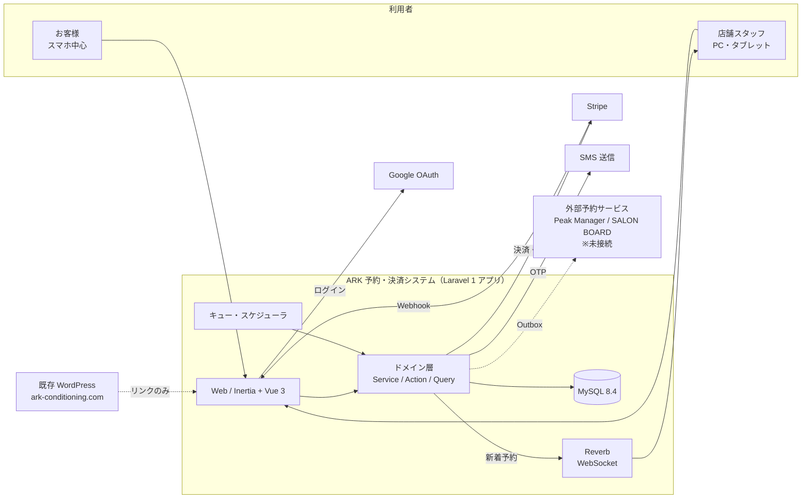
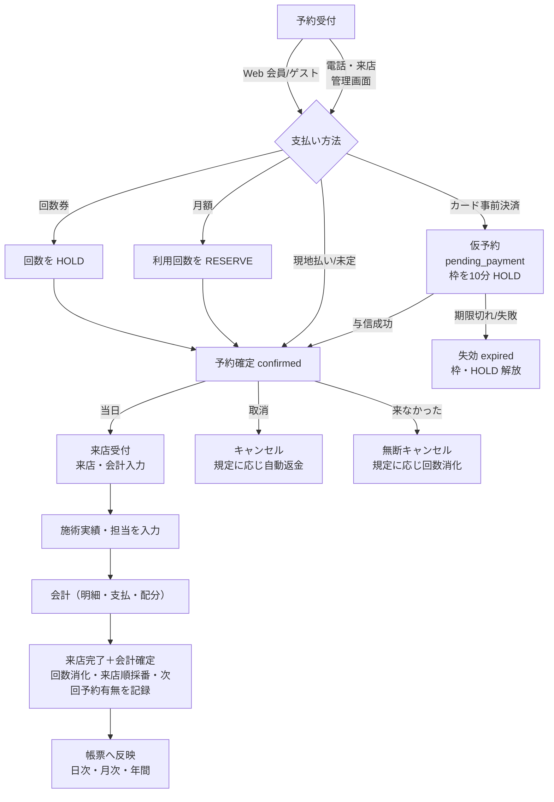
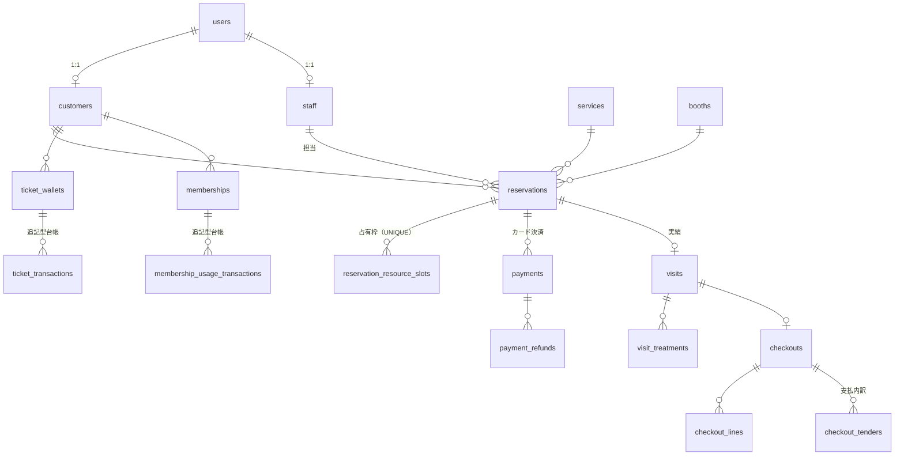

# 基本設計書 — ARK Conditioning 予約・決済システム

| 項目 | 内容 |
|---|---|
| 文書種別 | 基本設計書（外部設計） |
| 対象版 | `main` 2026-10-07 時点（HEAD `73c0532`） |
| 正本との関係 | 承認済み設計の正本は `docs/PLAN.md`。本書はそれと実装を突き合わせ、「何を・誰に・どう提供するか」を一冊にまとめたもの。食い違いがある場合は実装に合わせて記載し、`docs/review/2026-10-07-full-code-review.md` に差分を記録した |
| 詳細設計 | `docs/specs/detailed/` 配下（本書の各章から参照） |

---

## 1. システムの目的と範囲

### 1.1 目的

ARK Conditioning（コンディショニングサロン、単一店舗）の既存 WordPress サイトとは別に、次を提供する独立 Web システム。

1. お客様が自分で予約し、必要に応じて事前に決済できる
2. 店舗が予約台帳・顧客・来店・会計・売上を 1 つの画面群で管理できる
3. 回数券と月額プラン（利用権）を正確に管理できる
4. 旧 Excel / Google Sheets の帳票と同じ数字を自動で出せる

### 1.2 最優先の方針

> 実顧客・実予約・実個人情報・実決済を扱う。「動くこと」より、**二重処理が起きにくいこと**と、**障害時に 1 人で原因を追って復旧できること**を優先する。

優先順位：①安全性 ②データ整合性 ③保守性（1 人運用） ④バックアップ／復旧 ⑤予約・決済の確実性 ⑥操作性 ⑦管理画面 UX ⑧性能 ⑨DB 容量効率。高機能化によって上位が下がる設計は採らない。

### 1.3 範囲

| 区分 | 含む | 含まない（YAGNI） |
|---|---|---|
| 顧客向け | 会員登録／ログイン（メール・Google）、Web 予約（会員・ゲスト）、事前カード決済、マイページ（予約・回数券・月額・決済履歴・プロフィール） | LINE 連携、ポイント |
| 店舗向け | 予約台帳、予約管理、顧客管理（カルテ）、来店・会計入力、勤務枠、予定ブロック、メニュー・ブース・商品・スタッフ等のマスタ、回数券・月額の付与／調整、返金、帳票（日次・月次・年間・Excel）、システム監視 | 複数店舗、在庫管理、給与計算 |
| 外部連携 | Stripe（カード決済・サブスク）、Google ログイン、SMS（MFA） | Peak Manager／SALON BOARD の実 API 接続（抽象化と骨組みのみ。実仕様が確定してから） |

---

## 2. システム構成

### 2.1 全体構成



- WordPress とは **別リポジトリ・別 DB・別ドメイン**（想定：顧客 `member.ark-conditioning.com`、管理 `/admin`）。接点はリンクのみ。
- SPA と API の完全分離はしない。Inertia.js で 1 アプリとして描画する。

### 2.2 技術スタック

| 層 | 採用 |
|---|---|
| サーバー | Laravel 13 / PHP 8.3+ / モジュラーモノリス |
| 画面 | Inertia.js + Vue 3 + TypeScript + Vuetify 3（予約台帳は自作コンポーネント） |
| DB | MySQL 8.4（InnoDB / utf8mb4）。日時は UTC 保存、表示と営業日判定は `Asia/Tokyo` |
| 認証・権限 | Laravel Fortify（TOTP MFA）＋ spatie/laravel-permission（`web` guard 1 つ）＋ Socialite（Google） |
| 決済 | Stripe（PaymentIntent・手動 capture）＋ laravel/cashier（月額の課金契約のみ） |
| リアルタイム | Laravel Reverb（新着予約通知）。未接続時はポーリングで代替 |
| 開発環境 | Docker / Laravel Sail（PHP・Composer・MySQL はホストに入れない） |
| テスト | PHPUnit（Feature 中心、1191 件）＋ Vitest（フロントの純粋関数・小コンポーネント） |

### 2.3 ソフトウェア構成（層）

```
app/
├─ Http/Controllers   … 入力の受付と画面描画だけ。DB を直接更新しない
├─ Http/Requests      … 入力検証と一部の認可
├─ Actions            … マスタ等の単純な更新（1 操作 1 クラス）
├─ Domain/<業務>       … 業務ルールの唯一の入口（Service）と状態遷移
├─ Queries            … 画面用の読み取り専用クエリ
├─ Support            … StateMachine / AuditLogger / Settings / SlotKey / PiiHasher
└─ Modules/ExternalIntegration … 外部予約 Gateway（骨組み）
```

規則：**DB 更新は必ず Action または Domain Service 経由**。Controller や Vue から直接更新しない。重要な処理は入口を 1 つにする（例：予約の作成・変更・取消は `ReservationService` だけ）。

---

## 3. 利用者と権限

### 3.1 ロール

| ロール | 想定利用者 | 管理画面 | 主な権限（初期値） |
|---|---|---|---|
| customer | お客様 | 不可 | 自分の予約・決済・回数券・月額・プロフィールのみ |
| staff | 一般スタッフ | 可 | 予約・顧客の閲覧 |
| manager | 店長 | 可 | 予約の操作、会計、返金、回数券付与、月額管理、設定、監視の閲覧 |
| admin | オーナー／管理者 | 可 | 全権限（マスタ削除、権限設定、会計取消、帳票出力など） |

- staff と manager の権限は「権限設定」画面（admin のみ）で変更できる。admin と customer は固定。
- 権限の一覧と割当は [detailed/07_auth_security.md](detailed/07_auth_security.md) §3。

### 3.2 業務ロールの保護

- 管理画面に入るロールは **TOTP（6 桁）MFA 必須**。信頼済み端末は一定期間省略可。
- 返金・回数券／月額の付与・調整・解約、スタッフ管理、権限設定などの機微な操作は **パスワード再入力＋監査ログ**、返金は理由必須。
- 管理画面は deny-by-default（ルートごとに権限を要求）。

---

## 4. 業務フロー

### 4.1 予約から会計まで（全体）



### 4.2 主要な業務の概要

| 業務 | 概要 | 詳細設計 |
|---|---|---|
| Web 予約（会員） | メニュー → 日付・時間（空き枠）→ 担当 → 支払い方法 → 確定。カードは事前決済画面へ | [02_reservation.md](detailed/02_reservation.md) |
| Web 予約（ゲスト） | 会員登録なしで予約。確認リンク（推測不能なトークン）で変更・キャンセル・決済・会員化。SMS コードで予約を探せる | 同上 |
| 管理画面予約 | 台帳の空きセルから入力。未登録客は仮登録して予約。任意時刻・延長・指名・担当性別の希望に対応 | 同上 |
| 予約台帳 | スタッフ軸／ブース軸／両方、日・週表示、ドラッグで時間・担当・日付を変更、予定ブロック、新着通知、当日集計 | 同上 |
| カード決済 | 与信 → 確定時に capture。取消は与信取消、確定後は規定に応じて返金 | [03_payment.md](detailed/03_payment.md) |
| 回数券 | 購入（会計またはオンライン）／付与 → 予約で HOLD → 来店で消化。期限切れ・無断キャンセルのポリシーあり | [04_ticket_membership.md](detailed/04_ticket_membership.md) |
| 月額プラン | Stripe サブスク契約 → 期ごとに利用回数を付与 → 予約で RESERVE → 来店で消化。支払失敗時は猶予 | 同上 |
| 来店・会計 | 施術実績・実担当・指名を記録、会計明細（施術・物販・回数券・月額）、複数支払、施術/物販への配分、スタッフ売上配分 | [05_visit_checkout.md](detailed/05_visit_checkout.md) |
| 帳票 | 日報・月計・顧客統計・スタッフ稼働率・時間帯稼働率・スタッフ別売上・コース別売上・年間、旧 Excel 6 シート互換出力、過去データ取込・照合 | [06_reporting.md](detailed/06_reporting.md) |
| 勤務枠 | 基本シフト（曜日テンプレート）→ 毎朝自動生成。例外日・予約受付期間・直前締切 | [02_reservation.md](detailed/02_reservation.md) §6 |

---

## 5. 機能一覧

機能 ID は本書と詳細設計で共通に使う。

| ID | 機能 | 利用者 | 概要 |
|---|---|---|---|
| **F-AUTH** | **認証** | | |
| F-AUTH-01 | 会員登録・メール確認 | 顧客 | Fortify。パスワードは argon2id |
| F-AUTH-02 | ログイン／ログアウト | 全員 | メール＋パスワード、または Google |
| F-AUTH-03 | パスワードリセット | 全員 | |
| F-AUTH-04 | MFA（TOTP・SMS 予備・リカバリーコード） | 業務ロール | 業務ロールは必須。信頼済み端末 |
| F-AUTH-05 | Google 連携・解除 | 全員 | 特権ロールは自動作成・自動連携しない |
| **F-BOOK** | **顧客予約** | | |
| F-BOOK-01 | 空き枠表示（日・週） | 顧客 | 勤務枠・既存予約・予定ブロック・休業日・受付期間から算出 |
| F-BOOK-02 | 会員予約 | 会員 | `/reserve` |
| F-BOOK-03 | ゲスト予約 | 未ログイン | `/booking`。確認リンクを発行 |
| F-BOOK-04 | ゲスト予約の検索 | 未ログイン | 電話番号＋SMS コード |
| F-BOOK-05 | 予約の変更・キャンセル | 顧客 | 開始前のみ。キャンセル規定に従い返金 |
| F-BOOK-06 | ゲスト→会員化 | 未ログイン | 確認リンクから |
| **F-MY** | **マイページ** | | |
| F-MY-01 | 予約一覧・詳細 | 会員 | |
| F-MY-02 | 回数券 | 会員 | 残数・期限 |
| F-MY-03 | 月額プラン | 会員 | 申込（3DS 対応）・解約・再開・カード変更 |
| F-MY-04 | 決済履歴 | 会員 | |
| F-MY-05 | プロフィール・セキュリティ | 会員 | |
| **F-PAY** | **決済** | | |
| F-PAY-01 | 事前カード決済 | 顧客 | Payment Element。与信→capture |
| F-PAY-02 | 追加決済（延長等） | 顧客 | `single_addon` |
| F-PAY-03 | 返金 | manager+ | 理由必須・再認証・監査 |
| F-PAY-04 | Stripe Webhook 受信 | システム | 署名検証・冪等 |
| F-PAY-05 | 決済の突合・再同期 | システム／manager+ | 日次突合、手動同期 |
| **F-RSV** | **予約管理（店舗）** | | |
| F-RSV-01 | 予約台帳 | staff+ | 日／週、スタッフ／ブース／両方 |
| F-RSV-02 | 予約登録・編集（メニュー変更含む） | 予約操作権限 | |
| F-RSV-03 | ドラッグで時間・担当・ブース・日付変更 | 予約操作権限 | 確認ダイアログ必須 |
| F-RSV-04 | 延長 | 予約操作権限 | 追加メニュー・資格・空きを再判定 |
| F-RSV-05 | キャンセル・無断キャンセル・来店完了 | 予約操作権限 | |
| F-RSV-06 | 予定ブロック（休憩・会議等） | 予約操作権限 | |
| F-RSV-07 | 新着オンライン予約通知 | staff+ | Reverb＋ポーリング、既読は管理者ごと |
| F-RSV-08 | 未登録客の仮登録 | 予約操作権限 | |
| F-RSV-09 | 当日集計 | staff+ | 売上系は売上閲覧権限のみ |
| **F-CUS** | **顧客管理** | | |
| F-CUS-01 | 顧客一覧・検索 | 顧客閲覧 | 会員番号・氏名・電話（HMAC 一致） |
| F-CUS-02 | 顧客詳細（360°） | 顧客閲覧 | 予約・来店・回数券・月額・決済 |
| F-CUS-03 | プロフィール・メモ編集 | 顧客管理 | |
| F-CUS-04 | カルテ（流入経路・来店目的・紹介者・地域） | 顧客管理 | |
| **F-VIS** | **来店・会計** | | |
| F-VIS-01 | 来店受付（予約あり／飛び込み） | 会計権限 | |
| F-VIS-02 | 施術実績・実担当・指名の入力 | 会計権限 | |
| F-VIS-03 | 会計（明細・複数支払・配分） | 会計権限 | 税は明細単位・内税・切り捨て |
| F-VIS-04 | 来店なし会計（物販のみ等） | 会計権限 | |
| F-VIS-05 | 会計取消 | 会計取消権限（admin） | 理由必須 |
| **F-ENT** | **回数券・月額（店舗）** | | |
| F-ENT-01 | 回数券商品・月額プランのマスタ | 各管理権限 | 月額は再認証 |
| F-ENT-02 | 回数券の付与・取消・調整 | 回数券付与権限 | 再認証・理由 |
| F-ENT-03 | 月額の調整・即時解約・同期 | 月額管理権限 | 再認証 |
| **F-MST** | **マスタ・設定** | | |
| F-MST-01 | スタッフ（資格・担当メニュー・雇用形態） | スタッフ管理 | 再認証 |
| F-MST-02 | メニュー（所要時間・料金・分類・税・ブース・資格） | メニュー管理 | |
| F-MST-03 | ブース / 商品 | 各管理権限 | |
| F-MST-04 | 業務マスタ（分析分類・税区分/税率・決済方法・店舗カレンダー・売上目標・雇用形態・カルテ選択肢・資格） | 設定管理 | |
| F-MST-05 | 勤務枠（基本シフト・例外日・自動生成・予約受付期間） | シフト管理 | |
| F-MST-06 | 予約規定・回数券規定・通知設定 | 設定管理 | 規定変更は再認証 |
| F-MST-07 | 権限設定 | admin | |
| F-MST-08 | マスタの削除・復元（未使用のみ・論理削除） | admin | |
| **F-RPT** | **帳票** | | |
| F-RPT-01 | 日報・日計明細・日別営業記録 | 帳票閲覧＋売上閲覧 | |
| F-RPT-02 | 月計・概要・予約分析 | 同上 | |
| F-RPT-03 | 顧客統計（初診・再診・離反・継続） | 帳票閲覧 | |
| F-RPT-04 | スタッフ稼働率・時間帯稼働率・勤怠 | 帳票閲覧 | |
| F-RPT-05 | スタッフ別売上・コース別売上（目標） | 帳票閲覧＋売上閲覧 | |
| F-RPT-06 | 年間集計（4 月始まり） | 同上 | |
| F-RPT-07 | Excel 出力（旧 6 シート互換） | ＋出力権限 | |
| F-RPT-08 | 過去データ取込・照合 | 取込／照合権限 | |
| **F-SYS** | **システム** | | |
| F-SYS-01 | システム状態 | 監視権限 | Stripe・キュー・仮予約滞留・同期失敗・DB 使用量 |
| F-SYS-02 | 失敗ジョブ | 監視権限 | |
| F-SYS-03 | 監査ログ | 監査閲覧 | |
| F-SYS-04 | 外部予約連携の状態・再送 | 連携閲覧／管理 | |
| F-SYS-05 | 定期処理（失効・突合・付与・生成・掃除） | システム | [08_batch_operations.md](detailed/08_batch_operations.md) |

---

## 6. 画面一覧（概要）

画面は 83 本（`resources/js/Pages`）。詳細な項目・遷移・権限は [detailed/01_screens_routes.md](detailed/01_screens_routes.md)。

| 区分 | 画面 | 本数 |
|---|---|---|
| 公開 | トップ、ゲスト予約（予約・確認・決済・検索・検索結果） | 6 |
| 認証 | ログイン、会員登録、メール確認、パスワード（忘れ・再設定・再確認）、2 段階認証、Google 連携 | 8 |
| 顧客 | ダッシュボード、予約（作成・一覧・詳細）、決済（決済・履歴）、回数券、月額（一覧・3DS 確認）、プロフィール（表示・編集・セキュリティ） | 12 |
| 管理：予約 | ダッシュボード、予約台帳、予約一覧・編集 | 4 |
| 管理：顧客・会計 | 顧客（一覧・詳細・編集・回数券・月額）、来店・会計（一覧・入力）、決済（一覧・詳細） | 9 |
| 管理：マスタ | スタッフ、メニュー、ブース、商品、回数券商品、月額プラン（各 一覧・作成・編集）、勤務枠 | 19 |
| 管理：設定 | 業務マスタ、予約規定、回数券規定、通知、権限、MFA | 7 |
| 管理：帳票 | 概要、日計明細、日別営業記録、予約分析、月計、顧客統計、スタッフ稼働率、時間帯、スタッフ別売上、コース別売上、年間 | 11 |
| 管理：システム | システム状態、失敗ジョブ、監査ログ、外部連携 | 4 |

デザイン：ブランドカラーは紺 `#1A2653`（`docs/design/ARK_DESIGN_SYSTEM.md`）。顧客側はスマホ優先、管理側は PC・タブレット優先。

---

## 7. 外部インターフェース

| 相手 | 方向 | 方式 | 用途 | 障害時の扱い |
|---|---|---|---|---|
| Stripe API | ARK→Stripe | HTTPS（公式 SDK）、Idempotency-Key | PaymentIntent 作成／capture／取消、返金、Customer、Subscription | タイムアウト・5xx は「曖昧」として要対応にし、突合で回復。DB トランザクション中は呼ばない |
| Stripe Webhook | Stripe→ARK | `POST /stripe/webhook`、署名検証 | 決済・返金・請求・サブスクの状態変化 | 失敗時 500 を返し Stripe に再送させる。イベント ID で冪等 |
| Google OAuth | 双方向 | Socialite（state 検証） | ログイン・連携 | トークンは保存しない |
| SMS | ARK→送信事業者 | `SmsSender` 抽象（現状はログ出力実装のみ） | MFA の予備、ゲスト予約検索 | 本番の送信事業者は未決定 |
| 外部予約（Peak Manager / SALON BOARD） | 双方向 | Provider 抽象＋Outbox＋取込ジョブ | 予約の相互反映 | 実 API 未確定のため骨組みのみ。既定は無効（`null`） |
| Reverb | ARK→管理画面 | WebSocket（private channel） | 新着予約通知 | 切断時は 20 秒ポーリングで代替 |
| メール | ARK→顧客 | Laravel Mail（開発は Mailpit） | 会員登録確認、パスワード、ゲスト予約確認 | |

詳細は [detailed/03_payment.md](detailed/03_payment.md)、[detailed/09_external_integration.md](detailed/09_external_integration.md)。

---

## 8. データの概要

テーブル約 80。詳細は [detailed/10_data_model.md](detailed/10_data_model.md)。



| 分類 | 主なテーブル | 保持 |
|---|---|---|
| 予定 | reservations, reservation_resource_slots, reservation_segments, staff_shifts, staff_schedule_blocks | 業務データは永続。slot は過去分を整理 |
| 実績 | visits, visit_treatments, visit_treatment_staff, visit_staff_nominations | 永続 |
| 会計 | checkouts, checkout_lines, checkout_tenders, checkout_tender_allocations, staff_revenue_allocations | 永続 |
| 決済 | payments, payment_refunds, subscriptions | 永続（カード情報・Stripe 応答全文は保存しない） |
| 権利 | ticket_wallets / ticket_transactions、memberships / membership_usage_transactions | 永続・追記のみ |
| 技術 | webhook_events, audit_logs, reservation_sync_*, failed_jobs, db_size_snapshots | 保持期間つきで自動削除 |

**データの基本ルール**

- 金額は整数（円）。浮動小数を使わない。
- 個人情報（電話・生年月日）は暗号化して保存。検索用には独立鍵の HMAC を別列に持つ（平文の検索用コピーは持たない）。
- 回数券・月額は **追記型台帳**（`SUM(delta)` が残数）。更新・削除しない。全追記は `dedupe_key` UNIQUE で冪等。
- 状態の変更は **StateMachine** 経由のみ。定義していない遷移（とくに後戻り）はできない。
- 予約は「予定」、来店は「実績」、決済は「Stripe との取引」、会計は「店舗の売上」として責務を分ける。

---

## 9. 非機能要件

### 9.1 整合性・信頼性

| 項目 | 方式 |
|---|---|
| 二重予約防止 | `reservation_resource_slots (resource_type, resource_id, slot_start)` UNIQUE。同時 2 リクエストでも後発が失敗 |
| 同時編集 | 予約の `version`（楽観ロック）＋行ロック。競合は 409 |
| 二重課金・二重返金 | 永続 UUID から導出した Idempotency-Key、返金は保留中も合算して上限検査 |
| 外部通信と DB | 外部 HTTP の間は DB トランザクションを開かない。外部をまたぐ整合性は State Machine＋補償＋冪等 |
| 仮予約 | カード払いは 10 分 HOLD。毎分の失効処理で枠と HOLD を解放 |
| 冪等な定期処理 | 全バッチは再実行して安全。`withoutOverlapping` |
| 要対応の分離 | 自動で直るもの（再試行）と人の判断が要るもの（孤立決済・二重課金疑い）を分け、後者は `needs_attention` で画面に出す |

### 9.2 セキュリティ

- 認証：argon2id、ログイン等の回数制限、業務ロールの TOTP 必須、機微操作の再認証。
- 認可：ルート単位の権限（deny-by-default）＋Policy。顧客の個人情報は顧客閲覧権限が無ければサーバー側で除外。
- 入力：Eloquent／クエリビルダのバインドのみ。Vue の自動エスケープ、ユーザー入力に `v-html` を使わない。CSRF。
- ヘッダ：CSP、`Referrer-Policy: strict-origin-when-cross-origin`、`X-Content-Type-Options`、管理画面は `X-Frame-Options: DENY`。
- 秘密情報：`.env` のみ。Stripe Live キーを開発・テスト環境で検出したら起動拒否。ログ・監査・例外に PII やトークンを出さない。
- 決済カード情報は ARK を通らない（Payment Element、SAQ A 想定）。

詳細：[detailed/07_auth_security.md](detailed/07_auth_security.md)

### 9.3 性能・容量

- 想定規模：単一店舗、予約可能リソース 10 前後、営業 12 時間。
- 帳票は集計テーブルを持たず事実データから都度集計。月計でも SQL 本数を固定（1 日ごとの N+1 を禁止）。
- DB 容量方針：バイナリ・API 応答全文・Webhook 本文を DB に入れない。JSON・TEXT を多用しない。日次で DB 使用量を記録し閾値で警告。

### 9.4 運用・保守

- 1 人で保守できることを前提に、レイヤーは Domain / Service / Action / Model ＋外部通信の Gateway に限定。
- 監視：システム状態画面、失敗ジョブ、監査ログ、決済・月額・回数券の日次突合（差異は非 0 終了で失敗記録）。
- バックアップ：毎日 01:30 に DB＋`storage/app`、7 日＋週 1 を 4 週保持、失敗はメール通知、`ark:backup:verify-restore` で別 DB への復元を検証（オフサーバー保存は本番構築時に設定。`OPERATIONS.md` §1-2）。
- 手順書：`docs/OPERATIONS.md`（復旧）、`docs/TROUBLESHOOTING.md`、`docs/DEPLOYMENT.md`。
- 管理画面のセッションは無操作で自動ログアウトしない（`docs/SESSION_POLICY.md`）。

### 9.5 環境

| 環境 | 用途 | 決済 |
|---|---|---|
| local（Sail） | 開発・テスト | Stripe Test Mode のみ |
| staging / production | 未構築（お名前.com 上の WordPress とは別に用意） | 本番切替は別途承認 |

---

## 10. 前提・制約・未決事項

- 単一店舗前提（`store_id` は持たない）。
- 予約の正本（System of Record）は既定で自システム（`RESERVATION_AUTHORITY=local`）。外部を正本にする切替は設計済みだが未実装。
- 未決事項は `docs/OPEN_QUESTIONS.md`。代表例：法定保存年数、返金の売上帰属日、SMS 事業者、外部予約サービスの API 仕様、旧 Excel との実数値照合（Task 11-13 BLOCKED）。
- レビュー指摘とその対応（Task 11-33 で High はすべて修正済み）：`docs/review/2026-10-07-full-code-review.md` §5。

---

## 付録 A. 用語

| 用語 | 意味 |
|---|---|
| 予約（reservation） | 将来の時間枠の約束。状態：仮予約・外部同期待ち・確定・来店完了・無断キャンセル・キャンセル・失効 |
| 来店（visit） | 実際に来た事実。予約なしの飛び込みも含む。営業日（JST）で集計 |
| 会計（checkout） | 店舗としての売上。明細・支払内訳・配分を持つ |
| 決済（payment） | Stripe との取引（与信・capture・取消・返金） |
| 回数券（ticket wallet） | 購入した回数の束。有効期限あり。FEFO（期限の近い順）で使う |
| 月額プラン（membership） | Stripe サブスクで課金し、期ごとに利用回数を付与する利用権 |
| HOLD / RESERVE | 予約時点で回数を押さえること。来店で CONSUME、取消で RELEASE |
| ブース | 施術ベッド・部屋などの物理リソース |
| 予定ブロック | 予約以外でスタッフ・ブースの時間を埋める（休憩・会議・清掃など） |
| 決済日基準／施術日基準 | 売上をいつの日付に計上するか。既定は決済日（受領日） |
| 要対応（needs_attention） | 自動では直せず人の確認が必要な状態 |
