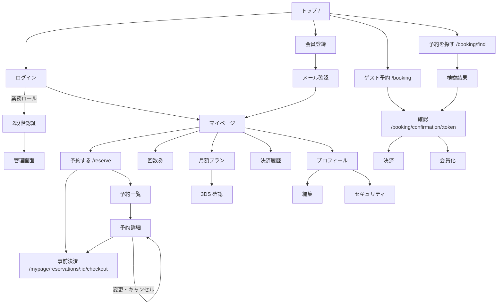
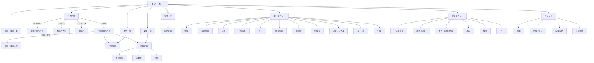

# 詳細設計 01 — 画面一覧・画面遷移・ルート

関連：基本設計 §5〜6。UI の部品・表示ルールは `docs/design/ARK_DESIGN_SYSTEM.md`、`docs/REPORTS_UI.md`。

## 1. 画面の共通仕様

| 項目 | 仕様 |
|---|---|
| 描画 | Inertia.js（サーバーが props を渡し、`resources/js/Pages/**.vue` を描画） |
| レイアウト | 管理：`layouts/AdminLayout.vue`（ヘッダーの集計・設定メニュー）／顧客：顧客用レイアウト |
| 共通部品 | `components/ark/*`（`PageHeader` / `SectionCard` / `StatusChip` / `EmptyValue` / `DateField` / `MonthField` / `YearField` / `MoneyField` / `TimeField` / `MasterDeleteButton` / `TrashedMasterList` / `ReportTable` ほか） |
| 文言 | `resources/js/constants/messages.ts` の `MESSAGES.<グループ>.<キー>` |
| 成功・失敗表示 | サーバーの `->with('success'|'error', …)` をフラッシュ表示。検証エラーは各項目に表示 |
| 型 | TypeScript。props の型は各ページ／`components/admin/**/types.ts` |
| 端末 | 顧客：スマホ優先／管理：PC・タブレット優先（台帳は 1023px 以下で縦積み） |
| ブランド色 | 紺 `#1A2653` |

## 2. 画面遷移

### 2.1 顧客

### 2.2 管理

## 3. 画面一覧

権限欄の `can:` 名は [07_auth_security.md](07_auth_security.md) §3。管理画面はすべて `admin.access`＋MFA が前提。

### 3.1 公開・認証

| 画面 | Vue | ルート | 認可 |
|---|---|---|---|
| トップ | `Welcome.vue` | `GET /` | なし |
| ログイン | `Auth/Login.vue` | Fortify `/login` | 未ログイン（`throttle:login`） |
| 会員登録 | `Auth/Register.vue` | `/register` | 同上 |
| メール確認 | `Auth/VerifyEmail.vue` | `/email/verify` | ログイン |
| パスワード忘れ・再設定 | `Auth/ForgotPassword.vue`、`Auth/ResetPassword.vue` | `/forgot-password`、`/reset-password/{token}` | |
| パスワード再確認 | `Auth/ConfirmPassword.vue` | `/user/confirm-password` | ログイン（`throttle:password-confirm`） |
| 2 段階認証 | `Auth/TwoFactorChallenge.vue` | `/two-factor-challenge` | ログイン途中 |
| Google 連携確認 | `Auth/LinkGoogle.vue` | `GET /auth/google/confirm`、`POST /auth/google/link-existing` | |
| Google | — | `/auth/google/redirect`、`/callback`、`/link`、`DELETE /unlink` | 連携・解除はログイン＋再認証 |

### 3.2 ゲスト予約

| 画面 | Vue | ルート |
|---|---|---|
| 予約 | `Booking/Index.vue` | `GET /booking`、`/booking/availability(/week)`、`POST /booking` |
| 予約確認 | `Booking/Confirmation.vue` | `GET/PUT/DELETE /booking/confirmation/{token}` |
| 決済 | `Booking/Checkout.vue` | `GET …/checkout`、`POST …/payment/sync` |
| 会員化 | （確認画面内） | `POST …/register-as-member` |
| 予約を探す | `Booking/Find.vue`、`Booking/FindResults.vue` | `GET /booking/find`、`POST …/send-code`、`POST …/verify` |

### 3.3 顧客（ログイン・メール確認済み）

| 画面 | Vue | ルート |
|---|---|---|
| マイページ | `Customer/Dashboard.vue` | （ホーム） |
| 予約する | `Customer/Reserve/Index.vue` | `GET /reserve`、`/reserve/availability(/week)`、`POST /reserve` |
| 予約一覧・詳細 | `Customer/Reservations/Index.vue`、`Show.vue` | `GET /mypage/reservations(/{id})`、`PUT`・`DELETE` 同 |
| 事前決済・追加決済 | `Customer/Payments/Checkout.vue` | `GET /mypage/reservations/{id}/checkout`、`…/addon/checkout`、各 `payment/sync` |
| 決済履歴 | `Customer/Payments/Index.vue` | `GET /mypage/payments` |
| 回数券 | `Customer/Tickets/Index.vue` | `GET /mypage/tickets` |
| 月額プラン | `Customer/Membership/Index.vue`、`Confirm.vue` | `GET /mypage/membership`、`POST subscribe`、`GET confirm`、`POST payment/sync`、`POST cancel`、`POST resume`、`PUT payment-method` |
| プロフィール | `Customer/Profile/Show.vue`、`Edit.vue`、`Security.vue` | `GET /mypage/profile`、`/profile/edit`、`PUT /profile`、`GET /mypage/security` |

### 3.4 管理：予約・顧客・会計・決済

| 画面 | Vue | ルート | 権限 |
|---|---|---|---|
| ダッシュボード | `Admin/Dashboard.vue` | `GET /admin` | admin.access |
| 予約台帳 | `Admin/Schedule/Index.vue` | `GET /admin/schedule` | reservations.view |
| 予約一覧 | `Admin/Reservations/Index.vue` | `GET /admin/reservations` | reservations.view |
| 予約編集 | `Admin/Reservations/Edit.vue` | `GET/PUT /admin/reservations/{id}(/edit)` | reservations.manage |
| 顧客一覧 | `Admin/Customers/Index.vue` | `GET /admin/customers` | Policy：customers.view |
| 顧客詳細 | `Admin/Customers/Show.vue` | `GET /admin/customers/{id}`（`/summary` も） | Policy：customers.view |
| 顧客編集 | `Admin/Customers/Edit.vue` | `GET/PUT /admin/customers/{id}(/edit)`、`PUT …/karte`、`PATCH …/note` | Policy：customers.manage（カルテは FormRequest） |
| 顧客の回数券 | `Admin/Customers/Tickets.vue` | `GET /admin/customers/{id}/tickets` | customers.view（付与等は ticket.grant） |
| 顧客の月額 | `Admin/Customers/Membership.vue` | `GET /admin/customers/{id}/membership` | customers.view（操作は membership.manage） |
| 来店・会計一覧 | `Admin/Checkouts/Index.vue` | `GET /admin/checkouts` | checkouts.manage |
| 来店・会計入力 | `Admin/Checkouts/Entry.vue` | `/admin/visits/{id}/checkout`、`/admin/checkouts/{id}` | checkouts.manage |
| 決済一覧・詳細 | `Admin/Payments/Index.vue`、`Show.vue` | `GET /admin/payments(/{id})` | reservations.view（返金は refund.execute） |

予約台帳内のサイドパネル（Vue コンポーネント）：`ReservationDetailPanel` / `CustomerSearchPanel` / `NewReservationPanel` / `ScheduleBlockCreatePanel` / 予定詳細。共通シェル `PanelShell`。日次集計 `ScheduleDailySummary`。

### 3.5 管理：マスタ・設定

| 画面 | Vue | ルート | 権限 |
|---|---|---|---|
| スタッフ | `Admin/Staff/Index.vue`、`Create.vue`、`Edit.vue` | `/admin/staff…`、`PATCH …/deactivate` | staff.manage（作成・編集・無効化は再認証） |
| 勤務枠 | `Admin/StaffShifts/Index.vue` | `/admin/staff-shifts…`（基本シフト・例外日・生成・予約受付・実勤怠） | shifts.manage |
| メニュー | `Admin/Services/Index.vue`、`Create.vue`、`Edit.vue` | `/admin/services…`、`PATCH …/active` | services.manage |
| ブース | `Admin/Booths/*` | `/admin/booths…` | booths.manage |
| 商品 | `Admin/Products/*` | `/admin/products…` | settings.manage |
| 回数券商品 | `Admin/TicketProducts/*` | `/admin/ticket-products…` | ticket_products.manage |
| 月額プラン | `Admin/MembershipPlans/*` | `/admin/membership-plans…` | membership.manage（保存は再認証） |
| 業務マスタ | `Admin/Settings/BusinessMasters.vue` | `/admin/settings/business-masters/…`（分析分類・税区分・税率・決済方法・カレンダー・定休曜日・売上目標・雇用形態・カルテ・資格） | settings.manage |
| 予約規定 | `Admin/Settings/ReservationPolicy.vue` | `GET/PATCH /admin/settings/reservation` | settings.manage（保存は再認証） |
| 回数券規定 | `Admin/Settings/Tickets.vue` | `GET/PATCH /admin/settings/tickets` | ticket_policy.manage（保存は再認証） |
| 通知 | `Admin/Settings/Notifications.vue` | `GET/PATCH /admin/settings/notifications` | settings.manage |
| 権限 | `Admin/Settings/Roles.vue` | `GET/PATCH /admin/settings/roles` | roles.manage＋再認証 |
| MFA | `Admin/Profile/Mfa.vue`、`TwoFactorSetup.vue` | `/admin/mfa`、`/admin/two-factor-setup` | 本人 |
| マスタ削除・復元 | （各一覧の部品） | `DELETE /admin/masters/{type}/{id}`、`POST …/restore` | masters.delete |

### 3.6 管理：帳票

[06_reporting.md](06_reporting.md) §4 を参照（`Admin/Reports/*.vue` 11 画面）。

### 3.7 管理：システム

| 画面 | Vue | ルート | 権限 |
|---|---|---|---|
| システム状態 | `Admin/System/Status.vue` | `GET /admin/system/status` | failed_jobs.view |
| 失敗ジョブ | `Admin/System/FailedJobs.vue` | `GET /admin/system/failed-jobs` | failed_jobs.view |
| 監査ログ | `Admin/System/AuditLogs.vue` | `GET /admin/system/audit-logs` | audit_logs.view |
| 外部連携 | `Admin/Integrations/Reservations.vue` | `GET /admin/integrations/reservations`、再送 `POST …/outbox/{id}/retry` | integrations.view／再送は integrations.manage＋再認証 |

## 4. ルート設計の規則

- 管理画面のルートは `routes/web.php` の `/admin` グループ内に置き、**個別に `can:` を付ける**（グループの `admin.access` だけで済ませない）。
- 機微操作は `password.confirm` を付ける（返金、回数券・月額の付与／調整／解約、スタッフ管理、月額プラン保存、予約規定・回数券規定の保存、権限設定、外部連携の再送、料金調整）。
- 静的なパス（例 `staff-shifts/templates`）は `{staffShift}` のような変数パスより前に登録する。
- 状態を URL に持たせる画面（予約台帳）は、Inertia の `router.get`（`preserveState` / `preserveScroll`）で遷移し、戻る／進む／再読込で復元できるようにする。
- JSON を返すデータ API は画面ルートに `/data` を付けた別ルートにする（帳票）。
