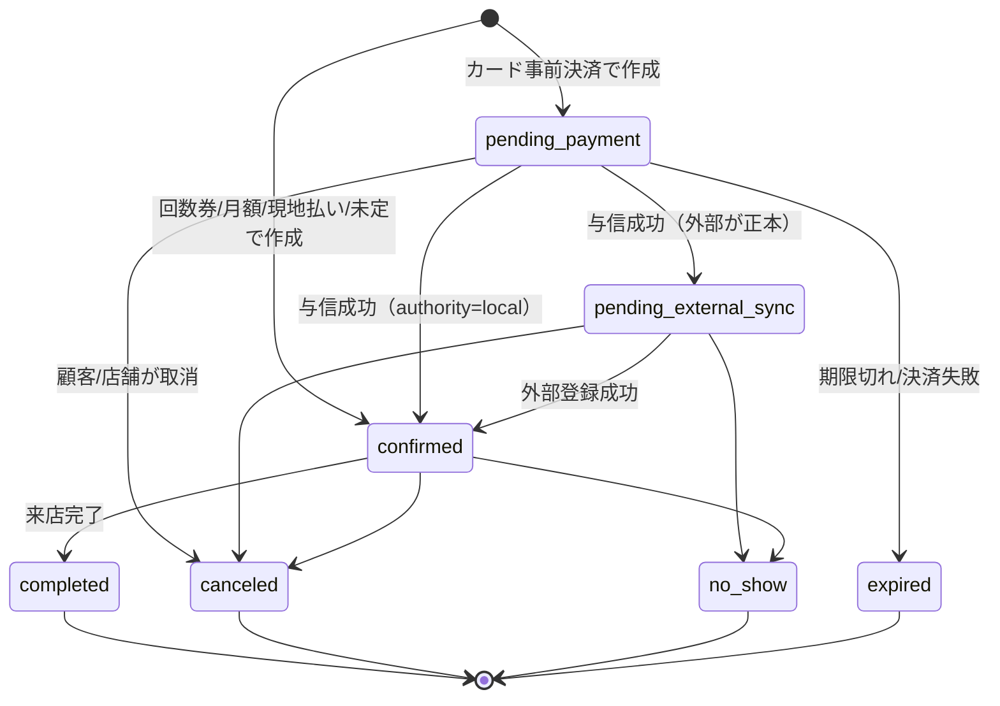
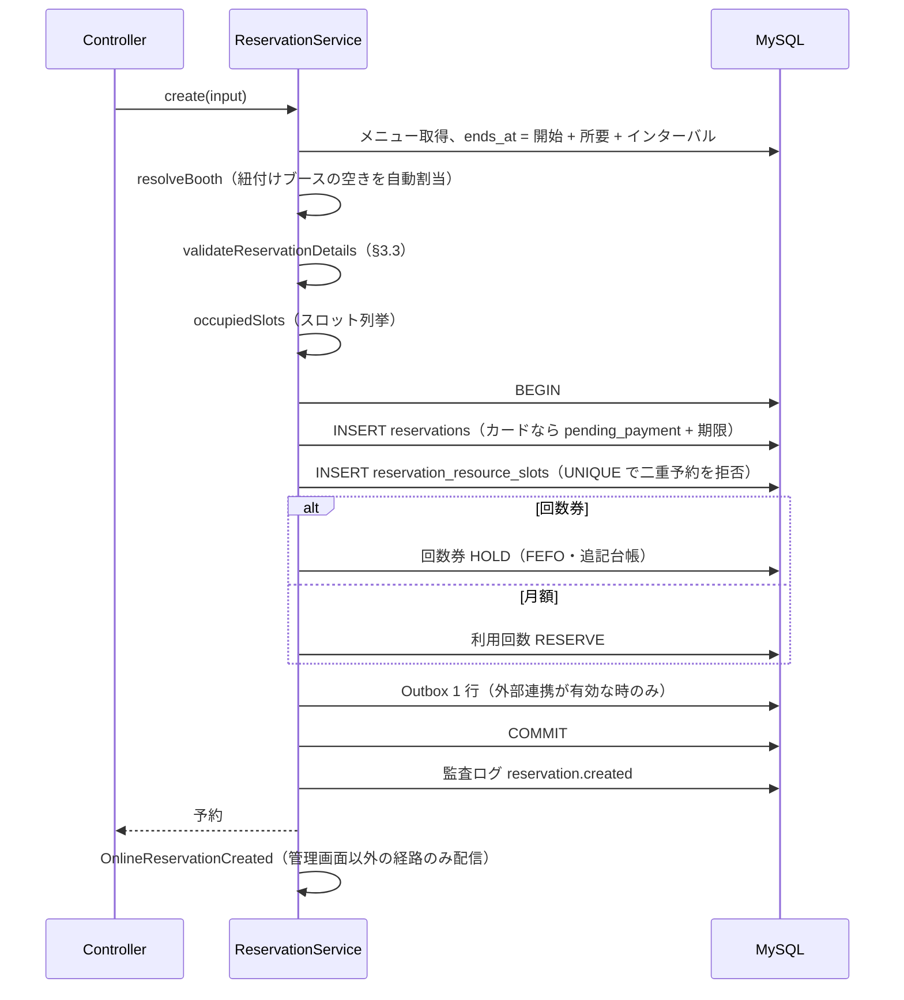
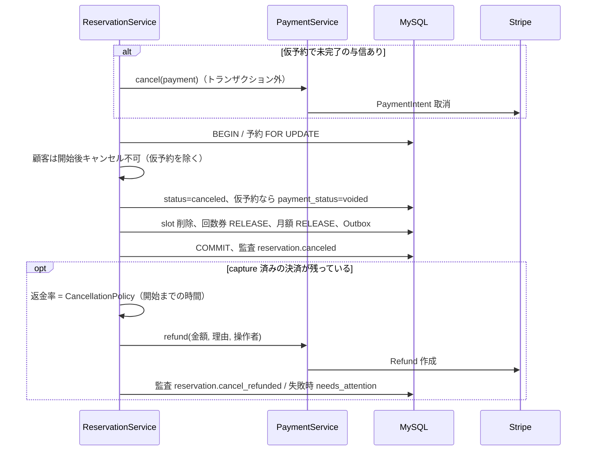

# 詳細設計 02 — 予約・空き枠・予約台帳・勤務枠

関連：基本設計 F-BOOK / F-RSV / F-MST-05、既存文書 `docs/ARCHITECTURE.md` §3〜4.7、`docs/BOOKING_RESOURCES.md`

## 1. 構成要素

| クラス | 責務 |
|---|---|
| `Domain\Reservation\ReservationService` | 予約の作成・変更・延長・キャンセル・無断キャンセル・来店完了の**唯一の入口** |
| `Domain\Reservation\AvailabilityService` | 空き開始時刻の算出（`openStartTimes`）、予約できない理由（`explainUnavailable`）、空きブース提案、出勤スタッフ判定 |
| `Domain\Reservation\WeekAvailabilityBuilder` | 週表示の空き（日ごとの `openStartTimes` を束ねる） |
| `Domain\Reservation\BookingWindow` | 予約受付期間・直前締切・休業日・営業時間の判定窓口 |
| `Domain\Reservation\BookingResourceResolver` | メニュー×ブース紐付け、メニュー×資格、スタッフの施術可否 |
| `Domain\Reservation\CancellationPolicy(+Resolver)` | キャンセル時の返金率と返金額 |
| `Domain\Reservation\ReservationStateMachine` / `ReservationPaymentStateMachine` | `status` / `payment_status` の遷移定義 |
| `Domain\Reservation\GuestReservationTokenService` | ゲスト確認リンクのトークン発行・検証 |
| `Domain\Schedule\ScheduleBlockService` | 予定ブロックの作成・変更・削除 |
| `Support\SlotKey` | スロット境界判定・占有スロット列挙 |
| `Queries\ScheduleQuery` | 予約台帳の表示データ（レーン・予約・ブロック・勤務・当日集計） |
| `Queries\ReservationPanelQuery` | 台帳サイドパネル（顧客・予約・回数券・月額・履歴）の集約 |
| `Queries\ScheduleNotificationQuery` | 未読の新着オンライン予約 |
| `Actions\StaffShift\*` | 勤務枠・基本シフト・例外日・自動生成 |

## 2. 状態遷移

### 2.1 予約状態（`reservations.status`）

- 遷移は `ReservationStateMachine` だけが行う。未定義の遷移は `InvalidStateTransitionException` → 画面には「この状態からは変更できません」（`messages.reservation.invalid_transition`）。
- 変更（日時・担当・メニュー）と延長は `confirmed` のみ可。

### 2.2 予約の支払状態（`reservations.payment_status`）

`unpaid → pending_payment → authorized → paid`、`pending_payment|authorized → failed → unpaid`、`authorized → voided`、`paid → refunded | partially_refunded`。後退遷移は定義しない。Stripe 側の `payments.status` との対応は [03_payment.md](03_payment.md) §2。

## 3. 予約の作成（`ReservationService::create`）

### 3.1 入力（`ReservationInput`）

| 項目 | 型 | 説明 |
|---|---|---|
| customerId | int | 顧客（`customers.user_id`） |
| serviceId | int | メニュー |
| staffId | ?int | 担当。メニューが `requires_staff` なら必須 |
| boothId | ?int | ブース。未指定でメニューにブース紐付けがあれば自動割当 |
| startsAt | CarbonImmutable | 開始 |
| bufferMin | int | 終了後インターバル（分）。枠として押さえる |
| source | ReservationSource | `ARK_WEB` / `ADMIN` / 外部各種 |
| paymentMethod | PaymentMethod | `single`（カード）/ `ticket` / `membership` / `onsite` / `unpaid` |
| isStaffRequested | bool | 指名か |
| staffGenderPreference | ?string | 担当性別の希望 |
| notes | ?string | 予約備考（最大 1000） |
| adminContext | bool | 管理画面からの操作か（制限の緩和に使う） |
| actorUserId | ?int | 操作者 |

### 3.2 処理手順

- 一意制約違反（SQLSTATE 23000）は `SlotUnavailableException` に変換 → 画面では 409 / 「この時間は埋まりました」。
- カード払いの HOLD 時間は設定 `reservation.hold_minutes`（既定 10 分、1 未満なら 10）。

### 3.3 予約内容の検証（`validateReservationDetails`）

上から順に判定し、最初に該当した理由で 422 を返す。

| # | 条件 | エラー（`messages.reservation.*`） | 管理画面でも適用 |
|---|---|---|---|
| 1 | メニューが無効 | `service_unavailable` | ○ |
| 2 | 顧客予約でオンライン予約不可メニュー | `service_not_online_bookable` | ×（管理は可） |
| 3 | 担当必須メニューで担当なし | `staff_required_for_service` | ○ |
| 4 | 担当もブースもなし | `resource_required` | ○ |
| 5 | 担当がそのメニューの担当者でない（`service_staff`） | `staff_not_assigned` | ○ |
| 6 | 担当が必要資格を持たない（`qualification_service`） | `staff_not_qualified` | ○ |
| 7 | 担当が予約不可（`is_bookable=false`）・存在しない | `staff_not_bookable` | ○ |
| 8 | 担当の勤務枠（`staff_shifts`）に開始〜終了が収まらない／日をまたぐ | `outside_shift` | ○ |
| 9 | 担当の予定ブロックと重なる | `staff_block_overlap` | ○ |
| 10 | ブースが無効・存在しない | `booth_unavailable` | ○ |
| 11 | ブースがメニューの紐付けブース以外 | `booth_not_for_service` | ○ |
| 12 | ブースの予定ブロックと重なる | `booth_block_overlap` | ○ |
| 13 | 顧客予約で開始が過去 | `past_datetime` | × |
| 14 | 店舗休業日 | `closed_date` | ○（物理的に不可） |
| 15 | 店舗カレンダーの営業時間外 | `outside_calendar_hours` | ○ |
| 16 | 顧客予約で受付期間外・直前締切（§6.3） | `BookingWindow` の文言 | × |
| 17 | 顧客予約でスロット境界でない開始時刻 | `non_boundary_start` | 管理は `allow_admin_free_time` 次第 |

予約同士の重複は検証ではなく、slot の一意制約で最終判定する（アプリのチェック漏れに依存しない）。

**予定ブロックとの重複（Task 11-33）**：ブロックには一意制約が無いため、`create` / `reschedule` / `extend` はトランザクション内で対象のスタッフ行・ブース行を `FOR UPDATE`（スタッフ ID 順 → ブース ID 順、変更時は旧・新の両方）で固定してから、ブロック重複をもう一度判定する。`ScheduleBlockService` の作成・変更も同じ順でロックしてから予約・他ブロックとの重複を判定するため、管理者 2 人が同じ時間に「予約」と「予定」を同時に入れても両方は成立しない。

### 3.4 スロット（`SlotKey`）

- スロット幅：設定 `reservation.slot_minutes`（既定 5 分）。
- 顧客予約：開始時刻は境界のみ。占有＝`[開始, 終了)` をスロット幅で刻んだ各境界。
- 管理画面で任意時刻（`RESERVATION_ALLOW_ADMIN_FREE_TIME=true`）：`floor(開始)`〜`ceil(終了)` を占有（端数スロットも押さえる）。
- 担当とブースの両方がある予約は、両方のリソースぶん行を作る。

## 4. 予約の変更・延長・キャンセル・無断キャンセル・来店完了

### 4.1 変更（`reschedule`）

- 入力：`RescheduleInput`（予約 ID、新しい担当／ブース／開始、`expectedVersion`、任意でメニュー・備考・指名・性別希望）。
- 手順：予約行を `FOR UPDATE` → `version` 不一致なら `StaleReservationException`（409）→ `confirmed` 以外は 422 → 顧客は開始前のみ → 新しい終了＝開始＋（現在の施術分数（延長含む）＋インターバル）→ ブース解決 → §3.3 の検証 → 既存 slot を削除し新 slot を挿入 → 予約更新（`version+1`）→ Outbox → COMMIT → 監査 `reservation.rescheduled`。
- メニュー変更：管理画面のみ。延長済み（`reservation_segments` あり）・事前決済／回数券／月額の予約は不可（料金・台帳の整合のため、取り直す）。施術分数は新メニューの標準時間になる。
- 担当が外れたら指名フラグも false。
- ドラッグ（台帳）は `PUT /admin/schedule/reservations/{id}/time` から同じ `reschedule` を呼ぶ。`staff_id` / `booth_id` は送られた時だけ変える（`Request::has`）。

### 4.2 延長（`extend`）

- 1〜180 分。`confirmed` のみ。`version` 一致必須。追加メニューが無効なら拒否（Task 11-33 / L-2）。
- 追加メニュー（省略時は元メニュー）を担当が施術できるか（担当者登録＋資格）を確認。
- 延長後の終了で §3.3 を再検証（管理扱い）し、slot を張り替え、`reservation_segments` に `kind=extension` で追記。監査 `reservation.extended`。

### 4.3 キャンセル（`cancel`）

- 与信取消の結果が不明なときは例外で止め、**結果不明のまま枠を解放しない**。
- 返金は予約キャンセルの COMMIT 後に行う。対象は capture 済み（`succeeded` / `partially_refunded`）で未返金残がある単発決済。
  1. まず Stripe から PaymentIntent を取得して返金累計を同期する（ダッシュボード等の外部返金を取り込む）。取得できなければ返金せず `needs_attention`。
  2. 返金額 ＝ min（キャンセル規定の額, 安全な残額）。安全な残額 ＝ 決済額 − max（同期済み返金累計, 成功済み返金合計）− 保留中返金合計。0 なら何もしない。
  3. 操作者が無い**ゲストのキャンセル**は、予約の顧客ユーザーを返金の操作者として会員と同じ経路で返金する（Task 11-33 / H-3。以前は返金されず要対応になっていた）。
  4. 返金の失敗・曖昧応答は決済に `needs_attention` と `cancel_refund_failed`、監査 `reservation.cancel_refund_failed`。
- 顧客コンテキスト：引数 `customerContext=true`、または操作者が顧客レコードを持ち、かつ管理画面権限（`admin.access`）を持たない場合（Task 11-33 / L-1。顧客レコードを持つスタッフが管理画面から操作しても顧客扱いにしない）。

**キャンセル規定（設定 `reservation.cancellation_tiers`）**

| 開始までの時間 | 返金率（既定） |
|---|---|
| 48 時間以上前 | 100% |
| 24 時間以上前 | 50% |
| それ以降 | 0% |

返金額＝`floor(決済額 × 返金率 / 100)` と「未返金残額」の小さい方。無断キャンセルの返金率は `reservation.no_show_refund_percent`（既定 0）。

### 4.4 無断キャンセル（`markNoShow`）

予約 `FOR UPDATE` → **開始前なら拒否**（`messages.reservation.not_started_no_show`。Task 11-33 / M-4）→ `no_show` へ遷移 → 回数券・月額の no-show ポリシー（`ticket.no_show_policy` 既定 `restore`、`membership.no_show_policy` 既定 `consume`）→ 監査 `reservation.no_show`。

### 4.5 来店完了（`markCompleted`）

`VisitCompletionService::completeReservation` に委譲（[05_visit_checkout.md](05_visit_checkout.md) §3）。会計免除理由（`free` / `prepaid` / `entitlement`）を任意で受け取る。

## 5. 空き枠の算出（`AvailabilityService::openStartTimes`）

入力：メニュー、担当（任意）、ブース（任意）、日付、インターバル、`withBooths`（ブースも考慮するか）。

1. メニューが無効なら空。占有分数＝所要時間＋インターバル。
2. 担当候補＝担当者登録あり・資格あり・予約可のスタッフ（指定があればその 1 人）。担当必須で候補 0 なら空。
3. ブース候補＝指定ブース、またはメニューの紐付けブース（紐付けなしで `withBooths` なら全有効ブース）。
4. 店舗カレンダー（`StoreCalendarService::resolve`）が休業または営業時間なしなら空。
5. 必要データを**日単位でまとめて**取得：勤務枠、占有 slot、予定ブロック（N+1 禁止）。
6. 開店時刻以降の最初の境界から、`開始＋占有分数 ≦ 閉店` の間、スロット幅ずつ候補を調べる。
   - 担当：勤務枠に収まる ∧ slot が空き ∧ ブロックと重ならない。
   - ブース：slot が空き ∧ ブロックと重ならない。ブースを考慮する時は 1 つ以上空きが必要。
7. 結果：`starts_at` / `ends_at` / `available_staff_ids`（担当指定なしかつ担当必須の時だけ）/ `available_booth_ids`（`withBooths` 時）。

受付期間・直前締切・過去時刻の除外は呼び出し側（予約画面のコントローラ）で `BookingWindow` を使って行う。`explainUnavailable` は 1 時刻について同じ判定を行い、直すべき点を文章で返す（台帳のトースト用）。

## 6. 勤務枠と予約受付

### 6.1 データ

| テーブル | 役割 |
|---|---|
| `staff_shift_templates` | 基本シフト（曜日×時間帯、同一曜日複数可） |
| `staff_shift_exceptions` | 例外日（休み／時間変更）。`(staff, date)` UNIQUE |
| `staff_shifts` | 実際の勤務枠。`origin=template`（自動生成）／`manual`（手入力・例外日） |
| `store_calendar_days` | 店舗の休業日・特別営業時間（通常日は行なし） |
| `settings` の `booking.*` | 予約受付期間・直前締切（未設定なら無制限） |

### 6.2 自動生成（`GenerateShiftsFromTemplates`、毎朝 06:00 `shifts:generate`）

- 予約受付期間ぶん、基本シフトから `origin=template` の枠を作る。**追加のみ**（削除しない）＝未来予約を巻き込まない。
- 同一 `(staff, date, start, end)` は作らない（冪等）。休業日・例外日・手動枠がある日は触らない。
- 例外日 `is_off=true` は、その日の `origin=template` 枠だけ削除（手動枠・予約には触れない）。
- 管理画面「今すぐ反映」でも実行できる。

### 6.3 予約受付期間（`BookingWindow`）

| 設定 | 値 | 意味 |
|---|---|---|
| `booking.horizon_mode` | `none` / `monthly` / `rolling` | 未設定＝`none`（無制限） |
| `booking.release_day_of_month` | 1〜28 | monthly：毎月この日以降は翌月末まで、前日までは当月末まで |
| `booking.horizon_days` | 日数 | rolling：今日から N 日後まで |
| `booking.min_lead_minutes` | 分 | 直前締切（例 60 → 1 時間前まで） |

受付期間と直前締切は**顧客の予約だけ**に効く。休業日は管理者を含め全員不可。

## 7. ゲスト予約

| 手順 | ルート | 内容 |
|---|---|---|
| 予約画面 | `GET /booking` | メニュー・空き枠（`/booking/availability`, `/week`） |
| 予約 | `POST /booking`（`throttle:guest-reserve`） | 氏名・電話・メール（任意）で仮会員（パスワードなし）を作り予約。確認リンクを発行しメール送信（`GuestReservationConfirmed`） |
| 確認 | `GET /booking/confirmation/{selector.validator}` | 予約内容、変更・キャンセル・決済・会員化の導線 |
| 変更 | `PUT` 同 | 担当未指定なら、担当必須メニューは空いている担当を自動選択、担当必須でないメニューは現在の担当のまま `reschedule`（顧客扱い。Task 11-33 / L-8） |
| キャンセル | `DELETE` 同 | `cancel(actor=null, customerContext=true)`。カード払い済みならキャンセル規定に従い自動返金（§4.3） |
| 決済 | `GET …/checkout`、`POST …/payment/sync` | カード事前決済 |
| 会員化 | `POST …/register-as-member` | パスワードを設定して会員に |
| 予約検索 | `GET /booking/find`、`POST /send-code`、`POST /verify`（`throttle:guest-lookup`） | 電話番号に SMS コード → 一致した予約一覧 |

**確認リンクのトークン**：`selector`（24 文字、公開・検索用）＋`validator`（40 文字、URL にだけ含め DB はハッシュ）。有効期限は「予約終了」と「現在」の遅い方＋1 年。不正・期限切れは常に 404（存在の有無を漏らさない）。

## 8. 予約台帳（`/admin/schedule`）

### 8.1 表示

| 項目 | 仕様 |
|---|---|
| 表示軸 | `axis=staff`（スタッフ行）/ `booth`（ブース行）/ `both`（スタッフ行の後にブース行、見出し行で区切る） |
| 期間 | `view=day` / `week`（週はスタッフ×日付の帯グラフ） |
| URL 状態 | `date` `view` `axis` `staff_id` `reservation` `panel` `customer` を URL に持ち、戻る／進む／再読込で復元 |
| データ | `ScheduleQuery::get()`：レーン、予約カード、予定ブロック、勤務枠（表示期間を 1 クエリ）、ブース、当日集計（日表示のみ） |
| 出勤判定 | `AvailabilityService::workingStaffIdsByDate`（空き枠と同じ正本） |

### 8.2 操作

| 操作 | 仕様 |
|---|---|
| カードクリック | 左パネルに予約詳細（`GET /admin/reservations/{id}/panel`）。顧客 PII は顧客閲覧権限がある時だけ返す |
| ドラッグ | 6px 未満の移動はクリック扱い。時間（スロット幅スナップ）・担当・ブース・日付（前日／翌日ボタン、ダイアログで任意日）を変更。**確認ダイアログで変更前後を表示し、「変更する」で初めて送信**。失敗時は元の位置へ戻す |
| ドラッグ対象 | 未来の `confirmed` のみ。`axis=both` ではドラッグ不可（対象リソースが曖昧なため） |
| 空きセルクリック | 「予約を入れる／予定を入れる」を選び、日時・担当・ブースを事前入力した新規パネルを開く。入力途中の内容はパネル切替で保持（`reservationDraft.ts`） |
| 顧客検索 | 会員番号（`ARK` + 6 桁）・氏名・電話（HMAC 一致） |
| スタッフ名クリック | 勤務枠画面へ（対象スタッフ選択済み） |

### 8.3 予定ブロック（`staff_schedule_blocks`）

- 種別：`BREAK`（休憩）/ `MEETING` / `WORK` / `ADMIN` / `CLEANING` / `TRAINING` / `OUT` / `OTHER`（`OTHER` はタイトル必須）。
- 担当かブースのどちらか必須。勤務時間内であること、予約・他ブロックと重ならないことを `ScheduleBlockService` がクエリで検証（一意制約は無い → レビュー M-3）。
- 顧客向けの通知・決済・回数券・月額には一切影響しない。作成・変更・削除は監査ログ。

### 8.4 新着オンライン予約通知

- 対象：`source` が `ADMIN` 以外の予約で、その管理者が未読のもの。
- 配信：`ReservationService::create` の COMMIT 後に `OnlineReservationCreated`（`ShouldBroadcastNow`）→ private channel `schedule-notifications`（`reservations.view` 保有者のみ購読可）。
- 補完：Reverb 未接続時は 20 秒、接続中は 120 秒間隔でポーリング（`GET /admin/schedule/notifications`）。予約 ID で重複排除。
- 既読：`reservation_notification_dismissals`（`user_id`, `reservation_id` UNIQUE）。端末をまたいで共有。

### 8.5 当日集計（日表示の下部）

| 項目 | 定義 | 正本 |
|---|---|---|
| 予約 | 当日開始の予約件数（仮予約・確定・完了・無断・キャンセル） | `reservations` |
| これから | 仮予約・外部同期待ち・確定 | 同上 |
| 来店完了 / 会計待ち / 新規 / リピーター / 次回予約 | 来店実績 | `DailyReportService` |
| 指名 / ネット予約 | キャンセル以外のうち、指名あり／`source≠ADMIN` | `reservations` |
| キャンセル / 無断キャンセル | | `reservations` |
| コース別 | 分析分類別の来店数 | `DailyReportService` |
| 売上・施術等・物販・決済方法別 | **売上閲覧権限がある時だけ**返す。決済日基準 | `DailyReportService` |
| 客単価 | 売上閲覧権限がある時だけ。**来店に紐づく確定会計の税込合計 ÷ 完了来店数**（月次概要と同じ定義。店頭販売は含めない。Task 11-33 / M-5） | `DailyReportService`（`visitGross`） |

スタッフ絞り込みに関係なく店舗全体を集計する。予約価格や現在のメニュー価格から売上を推測しない。

## 9. API 一覧（予約関連）

| メソッド・パス | 権限 | 用途 | 主な応答 |
|---|---|---|---|
| `GET /admin/schedule` | reservations.view | 台帳画面 | Inertia |
| `PUT /admin/schedule/reservations/{id}/time` | reservations.manage | ドラッグ変更（`starts_at`, `version`, 任意 `staff_id` `booth_id`） | 200 / 409 競合 / 422 検証 |
| `GET /admin/schedule/notifications` | reservations.view | 未読新着 | JSON |
| `POST /admin/schedule/notifications/{id}/dismiss` | reservations.view | 既読 | 204 |
| `POST/PUT/DELETE /admin/schedule/blocks(/{id})` | reservations.manage | 予定ブロック | |
| `PUT /admin/schedule/blocks/{id}/time` | reservations.manage | ブロックのドラッグ | |
| `GET /admin/reservations/{id}/panel` | reservations.view | 台帳パネル | JSON |
| `GET /admin/customers/{id}/board-panel` | reservations.view | 顧客のみのパネル（`date` で当日予約 ID） | JSON |
| `GET /admin/reservations/customer-search` | reservations.view | 顧客検索 | JSON |
| `POST /admin/reservations/provisional-customer` | reservations.manage | 未登録客の仮登録 | |
| `GET /admin/reservations/availability` | reservations.manage | 空き開始時刻 | JSON |
| `GET /admin/reservations/unavailable-reasons` | reservations.manage | 予約できない理由 | JSON |
| `GET /admin/reservations/available-booth` | reservations.manage | 空きブース提案 | JSON |
| `POST /admin/reservations` | reservations.manage | 作成 | |
| `PUT /admin/reservations/{id}` | reservations.manage | 編集 | |
| `POST /admin/reservations/{id}/extend` | reservations.manage | 延長 | |
| `PATCH /admin/reservations/{id}/cancel` / `complete` / `no-show` | reservations.manage | 状態変更 | |
| `POST /admin/reservations/{id}/adjustment` | reservations.manage + 再認証 | 料金調整（追加決済・返金。[03_payment.md](03_payment.md) §6） | |
| `GET /reserve`、`/reserve/availability(/week)`、`POST /reserve` | 会員（メール確認済） | 会員予約 | |
| `GET/PUT/DELETE /mypage/reservations/{id}` | 本人 | 予約詳細・変更・キャンセル | |

## 10. 設計上の注意（既知の論点）

- 月額の予約は「予約時点の期」の回数を使う（次期の回数は請求成功時に付与されるため、予約時点では存在しない）。現仕様として許容（Task 11-33 / M-1）。
- 回数券は予約日にかかわらず期限の近い順（FEFO）に押さえる。押さえた分は期限後も有効（`preserve_hold`）なので顧客に不利はない。現仕様として許容（Task 11-33 / M-2）。
- 来店完了・無断キャンセルは外部連携 Outbox に記録しない（外部連携の実仕様確定まで見送り。L-3）。
