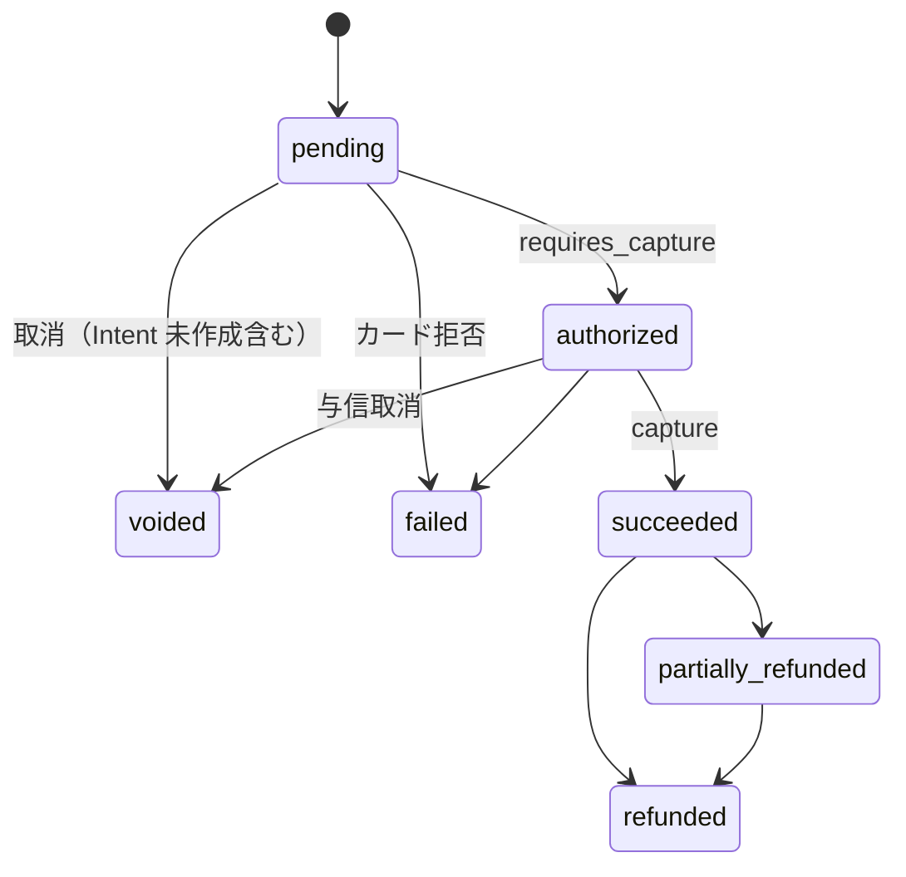
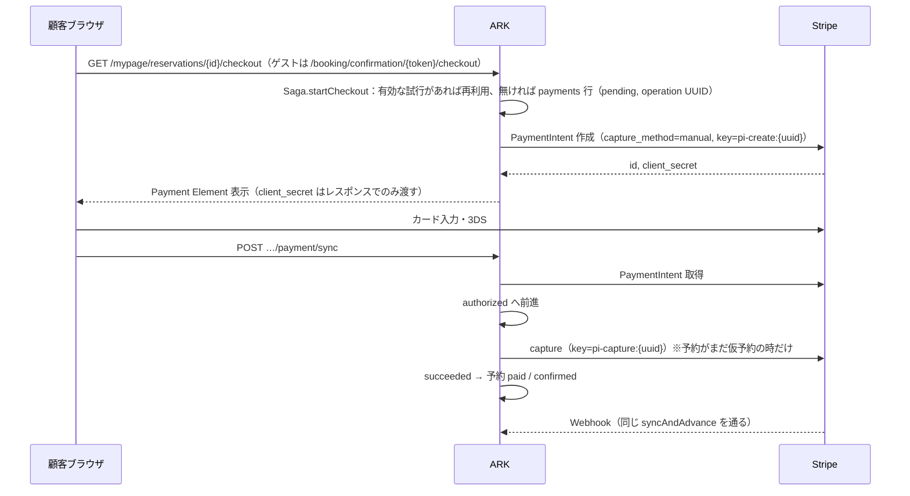

# 詳細設計 03 — 決済（Stripe）・返金・Webhook・料金調整

関連：基本設計 F-PAY、既存文書 `docs/ARCHITECTURE.md` §5〜6、`docs/OPERATIONS.md`、`docs/tasks/phase-05.md`

## 1. 方針

| 方針 | 実装 |
|---|---|
| 外部 HTTP 中に DB トランザクションを開かない | `PaymentService::assertStripeOutsideTransaction()` が `DB::transactionLevel() !== 0` なら `LogicException` |
| 冪等 | Idempotency-Key を **DB に永続化した UUID** から操作ごとに導出。リトライ回数や理由を含めない |
| 曖昧さを「失敗」にしない | タイムアウト・5xx・分類できないエラーは `needs_attention` を立てて状態は据え置き。突合で回復 |
| 状態は前進のみ | 古い Stripe 状態での巻き戻しは no-op。中間状態を観測できなかった時は定義済みの経路を辿って追いつく |
| 保存するのは ID と要約だけ | カード番号・CVC・`client_secret`・Stripe 応答全文・Webhook 本文は保存しない |
| Live キー禁止（開発・テスト） | `config/stripe.php` の `block_live_keys_in = [local, testing]` で起動時に拒否 |

## 2. 状態

### 2.1 `payments.status`

Stripe の PaymentIntent 状態との対応（`PaymentService::targetStatus`）：返金累計 ≧ 金額 → `refunded`、返金累計 > 0 → `partially_refunded`、`requires_capture` → `authorized`、`succeeded` → `succeeded`、`canceled` → `voided`、`requires_payment_method`＋失敗コードあり → `failed`、それ以外は変更なし。

### 2.2 予約側への反映（`ReservationCheckoutSaga::reflectOnReservation`）

| payments.status | reservations.payment_status | 予約状態 |
|---|---|---|
| pending | pending_payment | — |
| authorized | authorized | — |
| succeeded | paid | 仮予約なら **confirmed**（capture 後にだけ確定）、`payment_expires_at` を消す |
| voided / failed | voided / failed | — |
| refunded / partially_refunded | 同名 | — |

追加決済（`kind=single_addon`）は予約本体の状態を変えない。

### 2.3 `payments.kind`

`single`（予約の事前決済）/ `single_addon`（延長・料金調整の追加分）/ `ticket_purchase` / `membership_invoice`（将来用）。

## 3. 事前カード決済の流れ

- 顧客の戻り（sync）・Webhook・突合のどれから来ても `syncAndAdvance` という同じ経路を通るので、順序に依存しない。
- capture してよいのは「予約がまだ仮予約」の時だけ。失効・キャンセル済みの予約の与信は capture しない。
- 期限切れ（毎分 `payments:expire` → `Saga.expireReservation`）：未 capture の与信は取消して予約を `expired`、枠・HOLD を解放。**capture 済みは失効させず自動返金もしない**（`needs_attention` にして人が判断）。

## 4. Idempotency-Key（`config/stripe.php`）

| 操作 | テンプレート | 根 |
|---|---|---|
| PaymentIntent 作成 | `pi-create:{payment_operation_id}` | `payments.payment_operation_id`（UUID、UNIQUE） |
| capture | `pi-capture:{payment_operation_id}` | 同上 |
| 取消 | `pi-cancel:{payment_operation_id}` | 同上 |
| 返金 | `refund:{refund_operation_id}` | `payment_refunds.refund_operation_id`（UUID、UNIQUE） |
| サブスク作成 | `sub-create:{membership_operation_id}` | `memberships.membership_operation_id` |
| サブスク解約予約／再開 | `sub-cancel:…:{bucket}` / `sub-resume:…:{bucket}` | 同上＋操作回 |
| 即時解約 | `sub-cancel-now:{membership_operation_id}` | 同上 |

## 5. 返金

### 5.1 手順（`PaymentService::refund`）

1. 入力検証：金額 1 円以上、理由必須（255 文字以内）、操作者 ID が整数。
2. **Stripe と同期**（トランザクション外）：PaymentIntent を取得し、Stripe 上の返金累計を `refunded_amount` に取り込む（単調増加。減らさない）。取得できない・ID や金額が一致しない場合は**返金しない**（安全側）。
3. **TX1**：決済行 `FOR UPDATE` → `succeeded` / `partially_refunded` 以外は不可 → `max(refunded_amount, 成功済み返金合計) + 保留中返金合計 + 今回 ≦ 決済額` を検査 → `payment_refunds` を `pending` で作成（UUID 発番）。
4. トランザクション外で Stripe に返金要求（`refund:{uuid}`）。
5. 結果：
   - 成功 → **TX2**：決済・返金を `FOR UPDATE` → 返金 `succeeded` → `refunded_amount = min(決済額, max(既存値, 成功済み返金合計))`（減らさない）で `partially_refunded` / `refunded` → 監査 `payment.refunded`。COMMIT 後にもう一度 Stripe と同期し、外部返金を含む本当の累計へ揃える（失敗しても値は過小側で単調。次の返金時に再同期される）。
   - カード拒否 → 返金 `failed`、監査。
   - タイムアウト等 → 返金は `pending` のまま、決済に `needs_attention`。10 分ごとの `payments:settle-pending-refunds` が同じ UUID で再送して決着させる。
   - Stripe が `pending` を返した／金額不一致 → `needs_attention`（`refund_pending` / `refund_result_mismatch`）。

### 5.2 管理画面からの返金

`POST /admin/payments/{id}/refund`：権限 `refund.execute`（manager 以上）＋パスワード再確認＋理由必須＋監査。

### 5.3 Stripe ダッシュボード等での外部返金（Task 11-33 / H-4）

- 返金の正本は 2 つある：Stripe 上の返金累計（`refunded_amount` に同期）と、ARK から行った返金の記録（`payment_refunds`）。上限は常に**大きい方**を返金済みとみなして決める（安全側）。
- `refunded_amount` は Webhook（`charge.refunded`）・手動同期・返金前同期のどれから更新しても**減らない**。Webhook の重複・順序逆転でも巻き戻らない。
- ARK 自身の返金の Webhook が完了記録より先に届いても、外部返金と二重に数えない（TX2 は ARK の記録だけで更新し、外部分は COMMIT 後の再同期で取り込む）。
- 外部返金の `payment_refunds` 行は作らない（理由・担当者が無いため）。運用上は「返金は必ずアプリから」（`OPERATIONS.md` §2.3）。

## 6. 料金調整（追加決済・差額返金）

`POST /admin/reservations/{id}/adjustment`（`reservations.manage`＋再認証）→ `ReservationAdjustmentService::requestAdjustment(予約, 最終金額, 操作者)`。

1. 予約に `final_amount` を保存（行ロック）。
2. 受領済み純額 `netReceived`（capture 済み決済 − 返金）と比較。
3. 不足 → 追加決済（`single_addon`）を作成。同額の進行中追加決済があれば再利用。顧客はマイページ `…/addon/checkout` で支払う。
4. 過剰 → 差額を返金。返金に失敗したら `refund_failed` と未解消額を返す。
5. 結果：`addon_created` / `addon_reused` / `refunded` / `no_change` / `addon_failed`。

## 7. Webhook

### 7.1 受け口（`StripeWebhookController`）

| 条件 | 応答 |
|---|---|
| Webhook シークレット未設定 | 500（受け付けない） |
| 署名不一致・不正 JSON | 400（詳細はログにも出さない） |
| 処理結果 `failed` | 500（Stripe に再送させる） |
| `processed` / `duplicate` / `ignored` | 200 |

CSRF 除外・認証なし・Rate limit なし（Stripe の正常な再送を妨げないため）。

### 7.2 処理（`StripeWebhookProcessor`）

1. `webhook_events` に到着を記録（`stripe_event_id` UNIQUE）。既存行が `processed` / `ignored` なら重複として終了。`received` / `failed` のまま残っていた行は再処理する。
2. `invoice.*` / `customer.subscription.*` → `MembershipWebhookHandler`（[04_ticket_membership.md](04_ticket_membership.md) §3.4）。
3. 決済系（`payment_intent.succeeded` / `amount_capturable_updated` / `payment_failed` / `canceled` / `charge.refunded`）→ イベントから PaymentIntent ID だけを取り出し、該当 `payments` を特定 → `Saga.syncAndAdvance`（Stripe の現在状態を取得して前進）。
4. 対象外のイベント・自システムが作っていない PaymentIntent は `ignored` として記録。
5. 本文は保存しない。ログには event_id・type・payment_id・例外クラス名だけ。

### 7.3 復旧手段

| 手段 | コマンド | 用途 |
|---|---|---|
| 再生 | `stripe:replay {event_id}` | Stripe がイベントを保持する約 30 日以内 |
| 突合 | `payments:reconcile`（毎日 03:45） | Stripe オブジェクトから再同期（期限なし）。差異は非 0 終了 |
| 返金決着 | `payments:settle-pending-refunds`（10 分ごと） | `pending` 返金の再送 |
| 手動同期 | `POST /admin/payments/{id}/sync`（`reservations.manage`） | 1 件だけ取り直す |

## 8. 画面・API

| メソッド・パス | 権限 | 内容 |
|---|---|---|
| `GET /mypage/reservations/{id}/checkout` | 本人 | 決済画面 |
| `POST /mypage/reservations/{id}/payment/sync` | 本人（`throttle:reserve`） | 決済結果の取り込み |
| `GET/POST /mypage/reservations/{id}/addon/…` | 本人 | 追加決済 |
| `GET /booking/confirmation/{token}/checkout`、`POST …/payment/sync` | トークン | ゲスト決済 |
| `GET /mypage/payments` | 本人 | 決済履歴 |
| `GET /admin/payments`、`/{id}` | reservations.view | 決済一覧・詳細（要対応で絞り込み） |
| `POST /admin/payments/{id}/sync` | reservations.manage | 手動同期 |
| `POST /admin/payments/{id}/refund` | refund.execute＋再認証 | 返金 |
| `POST /stripe/webhook` | 署名 | Webhook |

## 9. エラーと画面表示

| 事象 | 決済の状態 | 顧客への表示 | 店舗の対応 |
|---|---|---|---|
| カード拒否 | failed | 「カード決済が承認されませんでした」（Stripe の生メッセージは出さない） | 不要 |
| 通信タイムアウト | 据え置き＋needs_attention | 再読み込みで結果確認 | 突合で自動回復、残れば決済詳細から同期 |
| PaymentIntent ID・金額の不一致 | 据え置き＋needs_attention | エラー | 決済詳細で確認（`payment_intent_mismatch` / `payment_amount_mismatch`） |
| キャンセル返金の失敗 | needs_attention（`cancel_refund_failed`） | キャンセルは完了 | 決済詳細から返金 |
