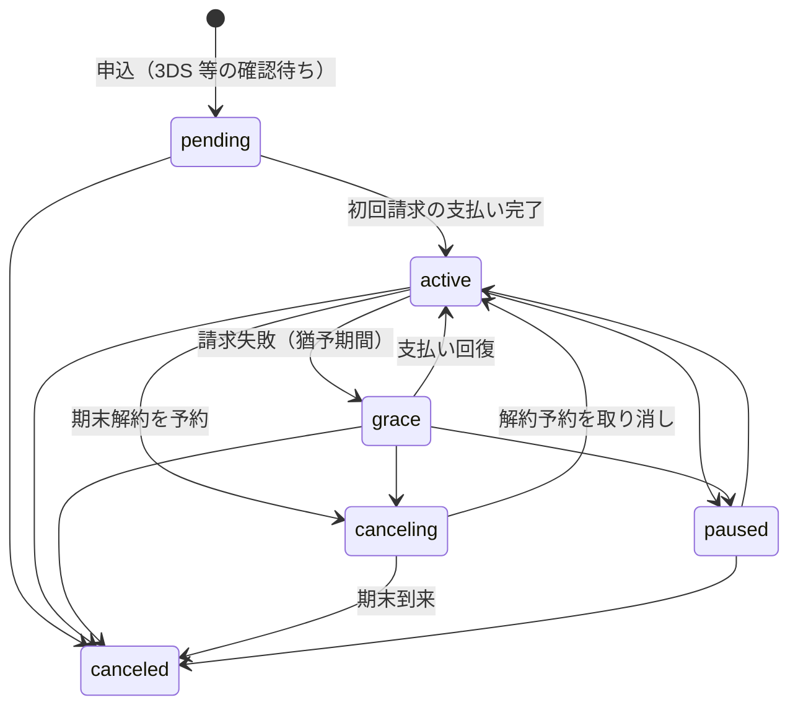
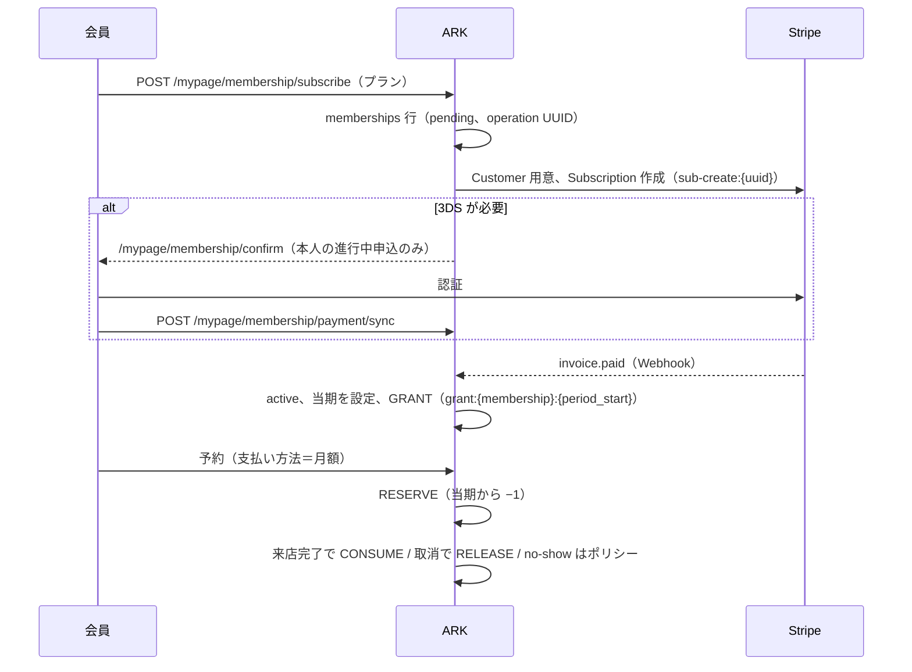

# 詳細設計 04 — 回数券・月額プラン（利用権）

関連：基本設計 F-MY-02/03、F-ENT、既存文書 `docs/tasks/phase-04.md`（回数券）、`phase-06.md`（月額）

## 1. 共通の考え方：追記型台帳

回数券と月額の利用回数は、どちらも **「増減を 1 行ずつ追記する台帳」** で管理し、残数はその合計で求める。行の更新・削除はしない。

| 用語 | 定義 |
|---|---|
| available（使える回数） | `SUM(delta)`。予約で押さえた分（HOLD / RESERVE）は既に負の行として入っているので、**二重に引かない** |
| held（押さえ中） | 未解消の HOLD / RESERVE の本数 |
| total | available + held |
| キャッシュ列 | 回数券 `ticket_wallets.balance`、月額 `memberships.period_available`。台帳追記と**同一トランザクション**で更新し、日次の突合で検証 |
| 冪等 | 全追記に `dedupe_key`（UNIQUE）。同じ予約の HOLD・RELEASE・CONSUME、同じ期の GRANT が再試行で重複しない |

予約 1 件が使う権利は **回数券か月額のどちらか 1 つ**（同時に使わない）。予約と権利の対応は `ticket_reservation_usages` / `membership_reservation_usages`（どちらも `reservation_id` UNIQUE、状態 `held|reserved` → `released` / `consumed`）。

## 2. 回数券

### 2.1 データ

| テーブル | 主な列 |
|---|---|
| `ticket_products` | 名称、回数（`total_count`）、価格、有効日数、Stripe price ID、税区分、有効フラグ、論理削除 |
| `ticket_wallets` | 顧客、商品、購入回数、`balance`（キャッシュ）、`expires_at`、決済 ID、状態（`active` / `exhausted` / `expired`） |
| `ticket_transactions` | 種別、`delta`、予約 ID、操作スタッフ、理由、`dedupe_key` UNIQUE |
| `ticket_reservation_usages` | 予約 ↔ 回数券、no-show ポリシーの控え、状態 |

### 2.2 取引種別

| 種別 | delta | 発生 | dedupe_key 例 |
|---|---|---|---|
| PURCHASE | +N | オンライン購入 | — |
| GRANT | +N | 店舗付与・会計での購入 | `checkout-line:{line}:{n}` など |
| RESERVE_HOLD | −1 | 予約作成 | `resv:{id}:RESERVE_HOLD` |
| RESERVE_RELEASE | +1 | 予約キャンセル・失効・no-show（restore） | `resv:{id}:…` |
| CONSUME | 0（HOLD を確定） | 来店完了・no-show（consume） | `resv:{id}:CONSUME` |
| REVOKE | −残数 | 店舗による取消 | |
| EXPIRE | −残数 | 期限切れ（`tickets:expire`） | `expire:{wallet}:{yyyymm}` |
| ADJUST | ±N | 店舗による調整（理由必須） | |

### 2.3 予約で使う回数券の選択（`TicketFefoSelector`）

顧客の `active` かつ `expires_at ≧ 今日` の回数券を、期限が近い順（同じなら作成順・ID 順）に `FOR UPDATE` で取得し、available ≧ 1 の最初の 1 枚を使う。予約日と期限の関係は見ないが、押さえた分は期限後も有効（`preserve_hold`）なので顧客に不利はなく、現仕様として許容（Task 11-33 / M-2）。

### 2.4 ポリシー（設定）

| 設定 | 値 | 意味 |
|---|---|---|
| `ticket.no_show_policy` | `restore`（既定）/ `consume` | 無断キャンセル時に押さえた回数を戻すか消化するか |
| `ticket.expiration_hold_policy` | `preserve_hold`（既定・唯一） | 期限切れ処理でも、予約で押さえた分は失効させない |

設定画面：`/admin/settings/tickets`（`ticket_policy.manage`、変更は再認証）。

### 2.5 店舗操作

| 操作 | ルート | 権限 |
|---|---|---|
| 付与 | `POST /admin/customers/{id}/tickets/grant` | `ticket.grant`＋再認証、理由 |
| 取消 | `POST /admin/ticket-wallets/{id}/revoke` | 同上 |
| 調整 | `POST /admin/ticket-wallets/{id}/adjust` | 同上 |
| 会計での購入 | 会計確定時に明細の数量ぶん GRANT（[05_visit_checkout.md](05_visit_checkout.md) §4.4）。会計取消で未使用分を REVOKE（同 §4.5） | `checkouts.manage` |

### 2.6 定期処理

- `tickets:expire`（毎日 03:00）：期限切れの回数券の残数を EXPIRE、状態 `expired`。押さえ中は除外（`preserve_hold`）。
- `tickets:reconcile`（毎日 03:15）：`balance` と台帳合計を突合。差異は非 0 終了。

## 3. 月額プラン（利用権）

### 3.1 データ

| テーブル | 主な列 |
|---|---|
| `membership_plans` | 名称、価格（`price`）、期ごとの利用回数（`usage_count_per_period`）、課金間隔（`billing_interval`、既定 month）、Stripe price ID、税区分、有効、並び順 |
| `memberships` | 顧客、プラン、`stripe_subscription_id` UNIQUE、`membership_operation_id` UNIQUE、`pending_operation`、状態、当期（`current_period_start` / `end`）、`cancel_at_period_end`、`grace_until`、`period_available`（キャッシュ）、`needs_attention`、`last_synced_at` |
| `membership_usage_transactions` | 期（`period_start`）、種別（GRANT / RESERVE / RELEASE / CONSUME / ADJUST）、delta、予約、理由、`dedupe_key` UNIQUE |
| `membership_reservation_usages` | 予約 ↔ 月額、予約した期、no-show ポリシーの控え、状態 |
| `subscriptions` / `subscription_items` | Cashier 標準。**課金契約の記録専用**（「月何回」は持たない） |

### 3.2 状態（`memberships.status`）

- 業務状態は ARK 側が正本。Stripe のサブスク状態をそのまま写さない。`canceled` は終端（古い Webhook で戻らない）。
- 予約に使える状態：`active` / `grace` / `canceling`（`config/membership.php` の `bookable_statuses`）。
- **解約予定（`canceling`）の利用期限（Task 11-33 / H-1）**：予約開始の JST 営業日 ≦ `current_period_end` かつ 今日（JST） ≦ `current_period_end` の時だけ予約できる。期末日当日は可、翌日以降は拒否（HTTP 409、`messages.membership.expired`）。日付は `BusinessTime::businessDate()` で JST に変換して比較する（UTC の日付を使わない）。
- 猶予：最大 `MEMBERSHIP_GRACE_MAX_DAYS`（既定 14 日）。`memberships:expire-grace`（毎日 04:15）が期限超過を処理。

### 3.3 申込から利用まで

### 3.4 Webhook（`MembershipWebhookHandler`）

| イベント | 処理 |
|---|---|
| `invoice.paid` | `MembershipBillingService::recordInvoicePaid`：請求を記録、期を更新、GRANT（冪等） |
| `invoice.payment_failed` / `invoice.payment_action_required` | `handlePaymentIssue`：`grace` へ、猶予期限を設定 |
| `customer.subscription.created` / `updated` / `deleted` | Stripe の現在オブジェクトを取得し直して前進（解約予定・解約・回復） |

決済系と同じく `webhook_events` で冪等化し、イベント本文では状態を決めない。

### 3.5 会員・店舗の操作

| 操作 | ルート | 権限 |
|---|---|---|
| 申込 / 3DS 確認 / 結果取り込み | `POST /mypage/membership/subscribe`、`GET …/confirm`、`POST …/payment/sync` | 本人 |
| 期末解約の予約 / 取り消し | `POST /mypage/membership/cancel`、`…/resume` | 本人 |
| カード変更 | `PUT /mypage/membership/payment-method` | 本人 |
| プランのマスタ | `/admin/membership-plans`（作成・更新・有効切替は再認証） | `membership.manage` |
| 利用回数の調整 | `POST /admin/memberships/{id}/adjust` | `membership.manage`＋再認証 |
| 即時解約 | `POST /admin/memberships/{id}/cancel-now`（理由） | 同上 |
| Stripe と再同期 | `POST /admin/memberships/{id}/sync` | `membership.manage` |

### 3.6 定期処理

| コマンド | 時刻 | 内容 |
|---|---|---|
| `memberships:grant-current` | 毎日 04:00 | 当期の GRANT 漏れを補う（冪等） |
| `memberships:expire-grace` | 毎日 04:15 | 猶予期限を過ぎた会員を処理 |
| `memberships:reconcile` | 毎日 04:30 | キャッシュと台帳、Stripe との突合（読み取りのみ、差異は非 0 終了） |

### 3.7 ポリシー

| 設定 | 既定 | 意味 |
|---|---|---|
| `membership.no_show_policy` | `consume` | 無断キャンセルで回数を消化（`restore` で戻す） |

### 3.8 仕様上の注意

- 予約は「予約時点の期」の回数を使う（次期の回数は `invoice.paid` で付与されるため、予約時点では存在しない）。現仕様として許容（Task 11-33 / M-1）。
