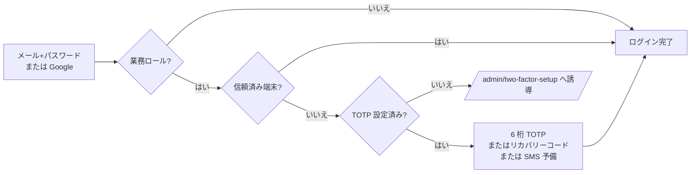

# 詳細設計 07 — 認証・権限・セキュリティ・監査

関連：基本設計 F-AUTH / §3 / §9.2、既存文書 `docs/ARCHITECTURE.md` §7〜8・認証 / MFA、`docs/MFA_MODERNIZATION.md`、`docs/SESSION_POLICY.md`

## 1. 認証

### 1.1 方式

| 項目 | 仕様 |
|---|---|
| ガード | `web` 1 つ。顧客とスタッフをガードで分けない（ロールで区別） |
| 基盤 | Laravel Fortify（登録・ログイン・メール確認・パスワードリセット・TOTP） |
| パスワード | argon2id。Google のみで登録したユーザーは `password` が NULL |
| Google | Socialite（state 検証あり）。ID は `user_social_accounts (provider, provider_user_id)` UNIQUE。メールアドレスを本人特定キーにしない。OAuth トークンは保存しない |
| 特権ロールと Google | コールバックで業務ロールのユーザーを自動作成・自動昇格・黙って連携しない。既存アカウントとの連携はパスワード確認（`/auth/google/confirm` → `link-existing`） |

### 1.2 MFA（業務ロール）

| 項目 | 仕様（`config/mfa.php`） |
|---|---|
| 判定の入口 | `Domain\Auth\MfaPolicy` のみ（`two_factor_confirmed_at` を各所で直接見ない） |
| 主手段 | TOTP 6 桁（Passkey は Phase 9.6 で撤去） |
| SMS | 予備手段。単独では MFA 要件を満たさない。OTP 6 桁・有効 300 秒・試行 5 回・再送間隔 60 秒・1 時間 5 回・IP あたり 1 時間 10 回。平文の OTP と電話番号は保存しない（`code_hash` / `phone_hmac`）。送信実装は現状 `LogSmsSender`（実送信なし） |
| 信頼済み端末 | 既定有効・365 日。cookie `ark_trusted_device`、`trusted_devices`（selector + ハッシュ）。TOTP の無効化・再生成で全端末を無効化 |
| 自己ロックアウト防止 | `PreventStaffTotpDisable`：業務ロールの TOTP 無効化を拒否 |
| 電話番号の登録・変更 | 再認証＋OTP 検証＋監査（`/admin/mfa/phone`、`throttle:6,1`） |

### 1.3 セッション

管理画面は無操作でも自動ログアウトしない（`docs/SESSION_POLICY.md`）。開いている間は `GET /admin/session/keep-alive` でセッションを延長する。

> 注意：信頼済み端末 365 日と自動ログアウトなしの組み合わせは、端末の紛失・共用時の影響が大きい。店舗端末の運用ルール（共用端末では「信頼しない」を選ぶ等）を `OPERATIONS.md` に置くことを推奨。

## 2. 管理画面の入口（ミドルウェア）

`/admin/*` は次の順で通す。

| 順 | ミドルウェア | 役割 |
|---|---|---|
| 1 | `web`, `auth`, `verified` | ログイン・メール確認済み |
| 2 | `AdminAccess` | `admin.access` 権限が無ければ 403 |
| 3 | `EnsureAccountIsActive` | 無効化されたアカウント（`users.is_active=false`）を拒否 |
| 4 | `EnsureStaffMfa` | MFA 未設定なら設定画面へ |
| 5 | ルート個別 `can:*` | 機能ごとの権限（deny-by-default） |
| 6 | `password.confirm` | 機微操作の再認証（`throttle:password-confirm` 6 回/分） |

ルート以外の認可：FormRequest の `authorize()`（例：顧客メモ・カルテ）、Policy（`CustomerPolicy` / `ReservationPolicy` / `SystemPolicy`）。顧客の個人情報（電話・メール・生年月日・メモ・履歴）は、`customers.view` が無い利用者にはサーバー側で応答から除外する（台帳パネル）。

## 3. 権限とロール

`database/seeders/RolePermissionSeeder.php`。admin は全権限で固定、customer は権限なしで固定。staff / manager は初回作成時だけ初期値を与え、以後は「権限設定」画面（`/admin/settings/roles`、`roles.manage`＋再認証）で変更する。

| 権限 | 意味 | staff | manager | admin |
|---|---|:-:|:-:|:-:|
| admin.access | 管理画面に入る | ○ | ○ | ○ |
| reservations.view | 予約・台帳の閲覧、顧客検索 | ○ | ○ | ○ |
| reservations.manage | 予約の作成・変更・状態変更、予定ブロック、決済の手動同期 | | ○ | ○ |
| customers.view | 顧客と個人情報の閲覧 | ○ | ○ | ○ |
| customers.manage | 顧客プロフィール・カルテの編集 | | | ○ |
| checkouts.manage | 来店・会計の入力・確定 | | ○ ※ | ○ |
| checkouts.void | 会計取消 | | | ○ |
| refund.execute | 返金 | | ○ | ○ |
| ticket.grant | 回数券の付与・取消・調整 | | ○ | ○ |
| membership.manage | 月額プラン・会員の管理 | | ○ | ○ |
| settings.manage | 業務マスタ・商品・予約規定・通知 | | ○ | ○ |
| integrations.view | 外部連携の状態 | | ○ | ○ |
| failed_jobs.view | 失敗ジョブ・システム状態 | | ○ | ○ |
| audit_logs.view | 監査ログ | | ○ | ○ |
| staff.manage / services.manage / booths.manage / shifts.manage | 各マスタ・勤務枠 | | | ○ |
| ticket_policy.manage / ticket_products.manage | 回数券規定・商品 | | | ○ |
| integrations.manage | Outbox 再送 | | | ○ |
| reports.view / reports.manage / reports.export / reports.reconcile | 帳票閲覧・日報編集・Excel・照合 | | | ○ |
| sales.view | 売上金額の閲覧 | | | ○ |
| historical_data.import | 過去データ取込 | | | ○ |
| masters.delete | マスタの削除・復元 | | | ○ |
| roles.manage | 権限設定 | | | ○ |

※ manager の `checkouts.manage` は初期値に加え、追加型 migration `2026_09_27_000007` が「`reservations.manage` を持つロール」へ付与する。表は**初期値**であり、本番の実際の割当は権限設定画面で確認する。

## 4. 回数制限（`FortifyServiceProvider`）

| 名前 | 上限 | キー |
|---|---|---|
| login / register / password-reset | 5 回/分 | メール＋IP |
| two-factor | 5 回/分 | ログイン中ユーザー ID または IP |
| password-confirm | 6 回/分 | ユーザー ID＋IP |
| google-oauth | 15 回/分（IP）、30 回/分（セッション） | |
| reserve（会員予約・決済同期等） | 10 回/分 | ユーザー ID または IP |
| guest-reserve | 5 回/分・20 回/時 | IP |
| guest-lookup（SMS コード送信・検証） | 5 回/分・20 回/時 | IP |
| 過去データ取込・MFA 電話・Google 解除 | `throttle:6,1` | |
| Stripe Webhook | なし（再送を妨げないため） | |

## 5. HTTP セキュリティ（`SecurityHeaders`）

- `Content-Security-Policy`（管理画面と顧客画面で別定義。Stripe・Reverb など必要な接続先のみ許可）
- `Referrer-Policy: strict-origin-when-cross-origin`（ゲスト確認リンク内のトークンを外部へ渡さない）
- `X-Content-Type-Options: nosniff`、`Permissions-Policy`
- 管理画面は `X-Frame-Options: DENY`
- CSRF：Laravel ＋ Inertia の XSRF-TOKEN。Stripe Webhook のみ除外

## 6. 個人情報と秘密情報

| 対象 | 方式 |
|---|---|
| 電話番号・生年月日（顧客）、電話（スタッフ） | `encrypted` cast（`text` 列）。検索用に `phone_hmac`（`PII_LOOKUP_KEY` による HMAC-SHA256、正規化した数字のみ）。`APP_KEY` とは独立した鍵。鍵を替えたら全行の再計算が必要 |
| ゲスト予約・信頼済み端末のトークン | selector（公開）＋validator（ハッシュのみ保存） |
| 過去データ取込の原文セル | 暗号化＋HMAC |
| カード情報 | ARK を通さない（Stripe Payment Element） |
| 秘密情報 | `.env` のみ。git・DB・Vue props・ログ・例外・監査・テストデータに置かない |
| ログ禁止 | メール・電話・住所・メモ・外部の生 payload・認証情報・トークン・`client_secret` |

## 7. 監査ログ（`Support\Audit\AuditLogger`）

- `audit_logs`：操作者、アクション、対象種別・ID、要約（500 字）、IP、日時。**変更前後のスナップショットは持たない**。
- 記録対象：認証イベント（`AuditAuthEvents`）、予約の作成・変更・延長・取消・無断・完了、決済の作成・与信・capture・取消・失敗・返金、回数券・月額の台帳操作、会計の確定・取消、予定ブロック、マスタ・設定・権限の変更、外部連携の再送。
- 保持：金銭・個人情報に関わるものは長期、その他 365 日（`system:prune-technical-logs`）。
- 閲覧：`/admin/system/audit-logs`（`audit_logs.view`）。

## 8. 入力・出力の安全

- SQL：Eloquent / クエリビルダのバインドのみ（`selectRaw` の値もバインド）。
- XSS：Vue の自動エスケープ。ユーザー入力に `v-html` を使わない（現状 0 件）。
- 画面メッセージ：サーバー `lang/ja/messages.php`、画面 `resources/js/constants/messages.ts` に集約（未移行の直書きはレビュー L-4）。
- Stripe の生エラーメッセージを顧客に出さない（安全なコードと固定文言に置き換える）。
