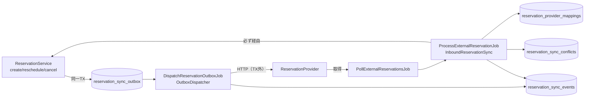

# 詳細設計 09 — 外部予約連携（Peak Manager / SALON BOARD）

関連：基本設計 §7、既存文書 `docs/ARCHITECTURE.md` §3〜4.1（正本）、`docs/tasks/phase-09.md`

> **現状**：実 API の仕様・利用料・双方向同期の可否が未確定のため、Provider は**骨組みのみ**（能力 0・全操作で例外・推測実装なし）。既定設定では連携は無効（`null`）で、予約の正本は自システム。本書は「仕様が確定したらどこに何を実装するか」を示す。

## 1. 2 つの切替軸

| 設定 | env | 値 | 意味 |
|---|---|---|---|
| 予約の正本（`config/reservation.php` `authority`） | `RESERVATION_AUTHORITY` | `local`（既定）/ `peak_manager` / `salon_board` | `local` 以外では外部登録成功まで顧客に「予約完了」を出さない（`pending_external_sync`）。**現フェーズは `local` 以外で起動拒否** |
| 連携先（`config/reservation_integration.php` `active_provider`） | `RESERVATION_INTEGRATION_PROVIDER` | `null`（既定）/ `peak_manager` / `salon_board` / `mock`（テスト用） | 正本とは独立。`local` のまま片方向ミラーも可能 |

起動時検証（`IntegrationServiceProvider::boot`）：未知のキー、本番での `mock`、`authority != local` は起動を拒否（fail-closed）。

## 2. 構成

| クラス | 責務 |
|---|---|
| `Contracts\ReservationProvider` / `AbstractReservationProvider` | `key` / `capabilities` / `healthCheck` / `fetchReservations` / `createReservation` / `updateReservation` / `cancelReservation`。能力を先に検査 |
| `ProviderRegistry` / `ProviderResolver` | キー → クラス。未知は拒否 |
| `Provider\PeakManagerReservationProvider` / `SalonBoardReservationProvider` | 骨組み（実装待ち） |
| `Provider\MockReservationProvider`（＋`MockReservationStore`） | テスト用 |
| `Service\ReservationOutboxRecorder` | `ReservationService` の各操作と**同一トランザクション**で Outbox に 1 行 |
| `Service\OutboxDispatcher` | 取得（`FOR UPDATE SKIP LOCKED`＋リース回収＋同一予約の順序待ち）→ 送信（TX 外）→ 結果反映 |
| `Service\InboundReservationSync` | 外部 → ARK の取込判定（下記 §4） |
| `Service\ProviderReconciler` | 突合（読み取り中心） |
| `Service\ReservationMappingRepository` | ARK 予約 ↔ 外部予約の対応 |
| `Service\ConflictRecorder` / `SyncEventRecorder` | 競合・同期イベントの記録 |
| `IntegrationContext` | 取込中は Outbox 記録を抑止（ループ防止） |
| `Support\ReservationFingerprint` / `ExternalStatusMapper` | 差分判定用の指紋、外部状態の対応表 |

旧来の `Modules\ExternalIntegration\Gateways\Reservation\*`（`NullExternalReservationGateway` など）は Phase 1 の Gateway 抽象。`Null` は全操作で `UnsupportedOperationException`（no-op 成功にしない）。

## 3. ARK → 外部（Outbox）

1. `ReservationService::create / reschedule / cancel / extend` が Outbox に 1 行（`idempotency_key = rsv-out:{op}:{reservation_id}:{seq}` UNIQUE）。連携無効時は記録しない。
2. 毎分 `reservations:dispatch-outbox` → `OutboxDispatcher::claimNext`：同じ予約の先行行が未完了なら待つ（順序保証）。
3. 送信結果：
   - 成功 → `succeeded`、対応表の指紋（共通の基準）を原子的に更新。
   - 一時失敗・曖昧 → backoff して `pending` に戻す。
   - 恒久失敗 → `needs_attention`（管理画面で再送：`POST /admin/integrations/reservations/outbox/{id}/retry`、`integrations.manage`＋再認証＋監査）。
   - 連携先が無効になった → 終了扱いにせず保留（park）。
4. Outbox の payload は開始・終了・状態・メニュー・担当のみ。自由記述（備考など）は載せない。
5. 来店完了・無断キャンセルは Outbox に記録しない（レビュー L-3）。

## 4. 外部 → ARK（取込）

`ProcessExternalReservationJob`（`ShouldBeUnique`）→ `InboundReservationSync`：

1. `(provider, external_id)` の advisory lock（`GET_LOCK`）で直列化。
2. 正規化（`ExternalReservationData`：氏名・連絡先は持たない）→ 検証。
3. 対応表を引き、重複判定（指紋 / `external_updated_at` / `rawVersion`）。
4. 判定結果：`NO_OP` / `CREATE` / `UPDATE` / `CANCEL` / `CONFLICT`。
5. 反映は**必ず `ReservationService` 経由**（slot の一意制約・楽観ロック・台帳を迂回しない）。
6. 自動反映は「確定予約の時刻・担当変更」と「キャンセル」のみ。順序を比べる材料が無い Provider は、2 回目以降の異なる内容を自動反映しない。
7. 両側で変更されていたら競合として記録（黙って上書きしない）。競合は指紋のみ保存し、個人情報の控えは持たない。`external_ref_hash` で重複排除、同時作成は一意制約違反を捕まえて収束。

## 5. データ

| テーブル | 主な列 | 制約 |
|---|---|---|
| `reservation_provider_mappings` | provider、reservation_id、external_reservation_id、external_customer_id、fingerprint、external_updated_at、external_version、last_synced_at、last_seen_at、sync_status | UNIQUE(provider, external_reservation_id)、UNIQUE(provider, reservation_id) |
| `reservation_sync_outbox` | provider、reservation_id、operation、idempotency_key、payload_json、status、attempts、available_at、locked_at/by、last_error_category/code、correlation_id、completed_at | idempotency_key UNIQUE |
| `reservation_sync_events` | provider、direction、operation、reservation_id、外部 ID（マスク）、correlation_id、idempotency_key、status、attempt、error_category、safe_error_code、開始・完了 | 追記専用（更新・削除で例外） |
| `reservation_sync_conflicts` | provider、reservation_id、外部 ID（マスク）、external_ref_hash、conflict_type、両側の指紋、detected_at、status、resolution、resolved_at/by | |
| `reservation_provider_sync_state` | provider、last_inbound_at、last_inbound_cursor、last_outbound_at、last_reconcile_at | provider UNIQUE |

## 6. 秘密情報・個人情報

- 認証情報は `.env` のみ（git・DB・画面・JS・ログ・例外・監査・テストデータに置かない）。
- ログ禁止：メール・電話・住所・備考・外部の生 payload・認証情報・トークン。
- 管理画面では外部 ID をマスク表示し、生 payload を返さない。

## 7. 実 API 確定後に必要な作業

1. Provider の能力・各操作の実装（`AbstractReservationProvider` を継承）。
2. エラーの分類（一時／恒久／曖昧）の対応表。
3. 契約テスト（Mock と同じテストを通す）。
4. 取込間隔・突合間隔の設定値。
5. 外部を正本にする場合は、`authority != local` の起動拒否を外し、決済の補償 Saga（与信 → 外部登録 → capture、失敗時は与信取消／返金）を有効化する（`ARCHITECTURE.md` §6）。
